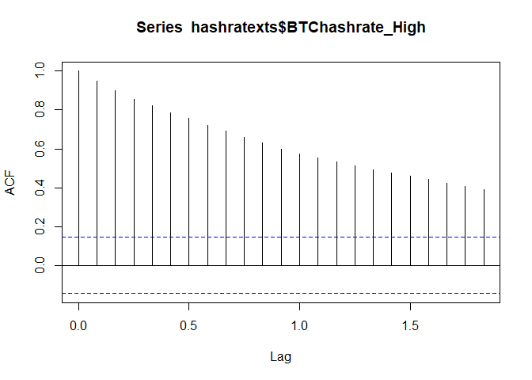
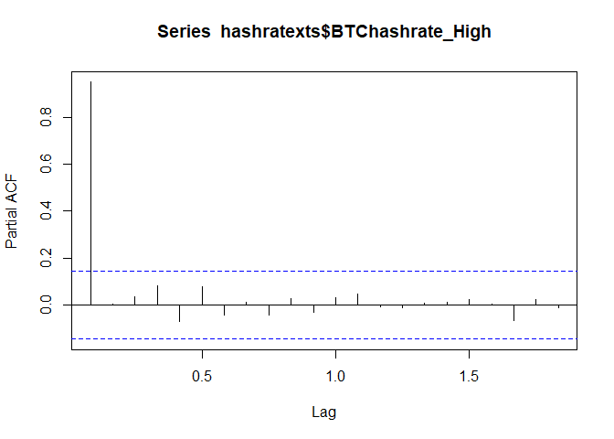

Bitcoin Factor Analysis
================

## Overview

This project will aim to develop an asset pricing model to explain the
returns for bitcoin (BTC). The initial data source will be crypto data
from CoinGecko via the geckor package. In addition to the daily price
data, the CoinGecko API provides daily market capitalizations and
trading volumes, which will be explored as asset pricing factors.
Additionally, we’ll consider more traditional asset pricing factors,
such as the Fama/French factors, which are shown not to explain bitcoin
returns. Lastly, we’ll consider some technical data from the Bitcoin
blockchain, such as network hashrate, and test if those help explain the
returns. For a more in-depth analysis on this topic across a wider range
of the crypto market, see [Liu, Tsyvinski, and Wu (2022), “Common Risk
Factors in Cryptocurrency,” *Journal of Finance*, 77(2):
1133-1177.](https://doi.org/10.1111/jofi.13119)

## R Packages

- The [devtools package](https://cran.r-project.org/package=devtools)
  contains the `install_github()` function, which allows us to install
  packages directly from GitHub. This will let us install the geckor
  package, which is no longer published to CRAN.
- The [geckor package](https://github.com/next-game-solutions/geckor) is
  a wrapper for the [CoinGecko API](https://www.coingecko.com/en/api)
  and allows for easy import of bitcoin price data.
- The [dplyr package](https://cran.r-project.org/package=dplyr) contains
  tools for data transformations.
- The [xts package](https://cran.r-project.org/package=xts) is short for
  ‘eXtensible Time Series’, which contains tools for working with time
  series data.
- The [lubridate package](https://cran.r-project.org/package=tseries)
  contains tools for working with date-math.
- The [readr package](https://cran.r-project.org/package=readr) is a
  common package for reading in factor data files. After installing, the
  RStudio Environment tab will have a new option to import data sets
  that uses this package. It will even generate the R code for you to
  copy and paste into your script.
- The [jsonlite package](https://cran.r-project.org/package=jsonlite)
  lets us more easily import JSON data.
- The [ggplot2 package](https://cran.r-project.org/package=ggplot2) for
  graphics and visuals.
- The [tseries package](https://cran.r-project.org/package=tseries)
  contains additional time series analysis functions that we will
  explore.
- The [rmarkdown package](https://cran.r-project.org/package=rmarkdown)
  is used to generate this R Notebook.

``` r
# Create list of packages needed for this exercise, omit geckor since its not on CRAN
list.of.packages = c("devtools","dplyr","xts","readr","jsonlite","ggplot2","tseries","rmarkdown")
# Check if any have not yet been installed
new.packages = list.of.packages[!(list.of.packages %in% installed.packages()[,"Package"])]
# If any need to be installed, install them
if(length(new.packages)) install.packages(new.packages)
# Since geckor is no longer published to CRAN, install via GitHub
library(devtools)
```

    ## Loading required package: usethis

``` r
devtools::install_github("next-game-solutions/geckor")
```

    ## Skipping install of 'geckor' from a github remote, the SHA1 (40955dad) has not changed since last install.
    ##   Use `force = TRUE` to force installation

``` r
# Load in the remaining packages
library(geckor)
```

    ## R client for the CoinGecko API
    ## Developed by Next Game Solutions (http://nextgamesolutions.com)

``` r
library(dplyr)
```

    ## 
    ## Attaching package: 'dplyr'

    ## The following objects are masked from 'package:stats':
    ## 
    ##     filter, lag

    ## The following objects are masked from 'package:base':
    ## 
    ##     intersect, setdiff, setequal, union

``` r
library(xts)
```

    ## Loading required package: zoo

    ## 
    ## Attaching package: 'zoo'

    ## The following objects are masked from 'package:base':
    ## 
    ##     as.Date, as.Date.numeric

    ## 
    ## ######################### Warning from 'xts' package ##########################
    ## #                                                                             #
    ## # The dplyr lag() function breaks how base R's lag() function is supposed to  #
    ## # work, which breaks lag(my_xts). Calls to lag(my_xts) that you type or       #
    ## # source() into this session won't work correctly.                            #
    ## #                                                                             #
    ## # Use stats::lag() to make sure you're not using dplyr::lag(), or you can add #
    ## # conflictRules('dplyr', exclude = 'lag') to your .Rprofile to stop           #
    ## # dplyr from breaking base R's lag() function.                                #
    ## #                                                                             #
    ## # Code in packages is not affected. It's protected by R's namespace mechanism #
    ## # Set `options(xts.warn_dplyr_breaks_lag = FALSE)` to suppress this warning.  #
    ## #                                                                             #
    ## ###############################################################################

    ## 
    ## Attaching package: 'xts'

    ## The following objects are masked from 'package:dplyr':
    ## 
    ##     first, last

``` r
library(lubridate)
```

    ## 
    ## Attaching package: 'lubridate'

    ## The following objects are masked from 'package:base':
    ## 
    ##     date, intersect, setdiff, union

``` r
library(readr)
library(jsonlite)
library(ggplot2)
library(tseries)
```

    ## Registered S3 method overwritten by 'quantmod':
    ##   method            from
    ##   as.zoo.data.frame zoo

## Data Imports

This section will build out a cleaned dataset for use in the subsequent
analysis. To start, we’ll import crypto price data from CoinGecko. Then
we’ll import factor data from Kenneth French’s website to see if known
equity factors explain bitcoin returns. Next, we’ll import some more
bitcoin-specific data to make a more tailored asset pricing model.

### Crypto Price Data

To start, we’ll import bitcoin price data using the geckor R package,
which imports data via the [CoinGecko
API](https://www.coingecko.com/en/api). Then for some additional points
of comparison, we’ll also import the price data for ether (ETH;
ethereum) and wrapped bitcoin (WBTC).

``` r
startdate = "2013-04-27"
coinids = c("bitcoin","ethereum","wrapped-bitcoin")
prices = coin_history_range(coin_id=coinids,
                            vs_currency = "usd",
                            from = as.POSIXct(startdate),
                            to = as.POSIXct(Sys.Date()))
```

    ## Warning: Missing values found in column(s)
    ## • market_cap
    ## Missing values found in column(s)
    ## • market_cap

Interestingly, as of January 2024, the above import code produces a
warning of some missing values in the market_cap column. If we more
closely examine (use `which()` and `is.na()` to identify the row numbers
of the missing values), these missing values appear to be for April 2,
2017. Not sure why exactly this is, but since we have price data on each
of those days, we can impute these values without too much difficulty.

``` r
# Identify indices of missing values
missinginds = which(is.na(prices$market_cap))
prices[missinginds,]
```

    ## # A tibble: 2 × 6
    ##   timestamp           coin_id  vs_currency  price total_volume market_cap
    ##   <dttm>              <chr>    <chr>        <dbl>        <dbl>      <dbl>
    ## 1 2017-04-02 00:00:00 bitcoin  usd         1098.     80231506.         NA
    ## 2 2017-04-02 00:00:00 ethereum usd           48.4    86493796.         NA

``` r
for (i in missinginds){
  # Subset data to 3-day period from [-1,1]
  subprice = prices[(i-1):(i+1),]
  # Create ncoins variable by dividing market cap by price
  subprice$ncoins = subprice$market_cap/subprice$price
  # Impute missing value with average of day before and day after
  subprice$ncoins[2] = (subprice$ncoins[1]+subprice$ncoins[3])/2
  # Compute missing market cap as price*ncoins
  subprice$market_cap[2] = subprice$ncoins[2]*subprice$price[2]
  # Move imputed value back to main data frame
  prices$market_cap[i] = subprice$market_cap[2]
}
sum(is.na(prices)) # Verify no more missing values
```

    ## [1] 0

#### Crypto Data Cleaning

Since the data format for each coin is similar, we can loop the data
cleaning process to simplify the scalability of the code. So if we add
more cryptos to analyze, we shouldn’t need to change any of this
cleaning code below. The comments in the code chunk should help clarify
the individual steps, but generally, it isolates the observations for
each coin, and then transforms the OHLCV data into an xts object. Since
some of the daily factors that we plan to explore only are observed at a
business-day frequency (and to focus on longer-term trends), we’ll
expand out to the monthly frequency with the price data. Then we
transform the monthly prices to annualized returns to resolve the
autocorrelation of the price series.

As an alternative measure, we’ll measure the annualized growth rate of
the market capitalization. With the gradual mining of new BTC into
existence, these growth rates will slightly outperform the price
appreciation (returns). However, as the halving cycles continue and the
upper-bound of 21 million BTC is approached, this gap between these
measurements will get smaller. When measuring financial returns, the
former (price-driven) return will be more appropriate, and for a more
general measurement of the growth in the economic magnitude of Bitcoin,
the latter (market-cap-driven) return will be more appropriate.

Lastly, since the OHLCV data includes daily trading volumes (which
converted to monthly totals), we’ll consider this a potential factor in
our analysis. In regard to interpretability, an elasticity
interpretation (percent change in volume leads to a beta percent change
in price) seems most appropriate here, so we’ll transform the monthly
trading volume into an annualized growth rate to explore as a factor.

``` r
dfs_month = list()

#coin = coinids[1] # This line is used for troubleshooting the code inside the for loop below
### To troubleshoot, uncomment the line above, and then comment out the for and } lines.
for (coin in coinids) {
  # Extract price data for each coin
  subdf = filter(prices, coin_id==coin)
  # Create xts object for each frequency
  dailyxts = xts(subdf[,4:6], order.by=as.Date(subdf$timestamp))
  monthxts = to.monthly(dailyxts)
  # Calculate annualized return of the coin's price movements
  monthxts$logprice = log(monthxts$dailyxts.Close)
  monthxts$annret = (monthxts$logprice - lag(monthxts$logprice))*12*100
  #monthxts$annret = (log(as.numeric(monthxts$dailyxts.Close)) - log(as.numeric(lag(monthxts$dailyxts.Close))))*12*100
  # Calculate alternative annualized return measurement from the market cap of the coin
  # Since to.monthly only converts OHLCV data by default, we must run again for market caps.
  monthxts2 = to.monthly(dailyxts$market_cap)
  monthxts$annret2 = (log(as.numeric(monthxts2$`dailyxts$market_cap.Close`)) - log(as.numeric(lag(monthxts2$`dailyxts$market_cap.Close`))))*12*100
  # Calculate volume growth rates
  monthxts$logvolume = log(monthxts$dailyxts.Volume)
  monthxts$volgrowth = (monthxts$logvolume - lag(monthxts$logvolume))*12*100
  # Calculate within-month volatility of annualized daily returns
  dailyxts$logprice = log(dailyxts$price)
  dailyxts$annret = (dailyxts$logprice - lag(dailyxts$logprice))*365*100
  monthxts3 = apply.monthly(dailyxts$annret, FUN=sd)
    # Fix dates from end of month to beginning of month like rest of data
    index(monthxts3) = ceiling_date(index(monthxts3), unit="month") - months(1)
  monthxts$dailyannretsd = monthxts3
  # Calculate within-month volatility in annualized volume growth rates
  dailyxts$logvolume = log(dailyxts$total_volume)
  dailyxts$volgrowth = (dailyxts$logvolume - lag(dailyxts$logvolume))*365*100
  monthxts4 = apply.monthly(dailyxts$volgrowth, FUN=sd)
    # Fix dates from end of month to beginning of month like rest of data
    index(monthxts4) = ceiling_date(index(monthxts4), unit="month") - months(1)
  monthxts$dailyannvolsd = monthxts4
  # Save data frames to output object
  dfs_month[[coin]] = monthxts
}
```

### Fama/French Factors

Another set of factors to consider are the Fama/French Factors. The
earlier [Fama and French
(1993)](https://doi.org/10.1016/0304-405X(93)90023-5) paper introduced a
three-factor model that includes SMB (Small Minus Big) as a ‘size’
factor and HML (High Minus Low) as a ‘value’/‘growth’ factor. See [the
3-Factors
webpage](https://mba.tuck.dartmouth.edu/pages/faculty/ken.french/Data_Library/f-f_factors.html)
for more detail. The data is also available there at the url in the data
chunk below. Since these are available as compressed folders, we must
first download the file (we’ll put it in a sub-folder, Factor Data) and
then decompress (unzip) the file before reading in the data. Then the
last few steps clean up the data, format to xts, and delete the
pre-Bitcoin data.

``` r
ff3url = "https://mba.tuck.dartmouth.edu/pages/faculty/ken.french/ftp/F-F_Research_Data_Factors_CSV.zip"
# Create subdirectory for file downloads
subdirectory = "Factor Data"
dir.create(subdirectory, showWarnings=FALSE)
# Define the file paths
zip_filepath = file.path(subdirectory, "FF3-factors.zip")
csv_filepath = file.path(subdirectory, "FF3-factors.csv")
# Download the zip file
download.file(ff3url, destfile=zip_filepath)
# Extract the CSV file from the zip file
unzip(zip_filepath, exdir=subdirectory)
# The file name in the line below comes from the name of the file within the zipped file
file.rename("Factor Data/F-F_Research_Data_Factors.CSV", csv_filepath)
```

    ## [1] TRUE

``` r
FF3 = read_csv(csv_filepath,
               col_types = cols(...1 = col_date(format = "%Y%m")), 
               skip = 2)
```

    ## New names:
    ## • `` -> `...1`

    ## Warning: One or more parsing issues, call `problems()` on your data frame for details,
    ## e.g.:
    ##   dat <- vroom(...)
    ##   problems(dat)

The code chunk above reports a warning about some parsing errors. So
let’s investigate with `problems()`.

``` r
problems(FF3)
```

    ## # A tibble: 104 × 5
    ##      row   col expected       actual                           file             
    ##    <int> <int> <chr>          <chr>                            <chr>            
    ##  1  1171     1 5 columns      1 columns                        C:/Users/Work/Pr…
    ##  2  1171     1 date like %Y%m Annual Factors: January-December C:/Users/Work/Pr…
    ##  3  1172     2 a double       Mkt-RF                           C:/Users/Work/Pr…
    ##  4  1172     3 a double       SMB                              C:/Users/Work/Pr…
    ##  5  1172     4 a double       HML                              C:/Users/Work/Pr…
    ##  6  1172     5 a double       RF                               C:/Users/Work/Pr…
    ##  7  1173     1 date like %Y%m 1927                             C:/Users/Work/Pr…
    ##  8  1174     1 date like %Y%m 1928                             C:/Users/Work/Pr…
    ##  9  1175     1 date like %Y%m 1929                             C:/Users/Work/Pr…
    ## 10  1176     1 date like %Y%m 1930                             C:/Users/Work/Pr…
    ## # ℹ 94 more rows

Note how it refers us to the bottom of the data frame. These are the
annual observations that are included below the monthly data. Since
those annual dates do not import and are missing, we can use
`complete.cases()` to easily identify the appropriate columns to retain.
Then the date variable imports with an unusual name of `...1`, so we’ll
fix that, and then reformat to an xts object. Lastly, we use the
`paste()` function to generate a string of `"2013-04-27/"`. This type of
indexing is part of the xts package, and the `/` separates a start date
from an end date.

``` r
# Trim annual observations from bottom of date frame (dates import as missing)
FF3 = FF3[complete.cases(FF3),]
# Fix date variable name
FF3 = FF3 |> rename(Date=...1)
# Reformat to xts object
FF3xts = xts(FF3[,-1], order.by=FF3$Date)
# Remove data prior to first BTC observation
FF3xts = FF3xts[paste(startdate,"/",sep="")]
# Annualize factor data to match annualized return scaling
FF3xts = FF3xts*12
```

More recently, [Fama and French
(2015)](https://doi.org/10.1016/j.jfineco.2014.10.010) includes two
additional factors: RMW (Robust Minus Weak) as a ‘profitability’ factor
and CMA (Conservative Minus Aggressive) factor. The [5-Factors
webpage](https://mba.tuck.dartmouth.edu/pages/faculty/ken.french/Data_Library/f-f_5_factors_2x3.html)
has more detail.

``` r
ff5url = "https://mba.tuck.dartmouth.edu/pages/faculty/ken.french/ftp/F-F_Research_Data_5_Factors_2x3_CSV.zip"
# Define the file paths
zip_filepath = file.path(subdirectory, "FF5-factors.zip")
csv_filepath = file.path(subdirectory, "FF5-factors.csv")
# Download the zip file
download.file(ff5url, destfile=zip_filepath)
# Extract the CSV file from the zip file
unzip(zip_filepath, exdir=subdirectory)
file.rename("Factor Data/F-F_Research_Data_5_Factors_2x3.CSV", csv_filepath)
```

    ## [1] TRUE

``` r
FF5 = read_csv(csv_filepath,
               col_types = cols(...1 = col_date(format = "%Y%m")), 
               skip = 2)
```

    ## New names:
    ## • `` -> `...1`

    ## Warning: One or more parsing issues, call `problems()` on your data frame for details,
    ## e.g.:
    ##   dat <- vroom(...)
    ##   problems(dat)

``` r
# Trim annual observations from bottom of date frame (dates import as missing)
FF5 = FF5[complete.cases(FF5),]
# Fix date variable name
FF5 = FF5 |> rename(Date=...1)
# Reformat numbers to numeric type and annualize
FF5$`Mkt-RF` = as.numeric(FF5$`Mkt-RF`)*12
FF5$SMB = as.numeric(FF5$SMB)*12
FF5$HML = as.numeric(FF5$HML)*12
FF5$RMW = as.numeric(FF5$RMW)*12
FF5$CMA = as.numeric(FF5$CMA)*12
FF5$RF = as.numeric(FF5$RF)*12
# Reformat to xts object
FF5xts = xts(FF5[,-1], order.by=FF5$Date)
# Remove data prior to first BTC observation
FF5xts = FF5xts[paste(startdate,"/",sep="")]
```

## Factor Model Regressions

### Trading Volume Growth as a Factor

Let’s start with just the crypto data and explore the idea of using
growth in trading volume as a factor to explain crypto returns. This
will also provide some structure to the following sets of regressions in
regard to aggregating data across the various xts objects and running
the regressions.

``` r
# Select relevant variables and merge into a single xts object
assets_volregs = merge(dfs_month$bitcoin$annret,
                       dfs_month$bitcoin$annret2,
                       dfs_month$bitcoin$volgrowth,
                       dfs_month$ethereum$annret,
                       dfs_month$ethereum$annret2,
                       dfs_month$ethereum$volgrowth,
                       dfs_month$`wrapped-bitcoin`$annret,
                       dfs_month$`wrapped-bitcoin`$annret2,
                       dfs_month$`wrapped-bitcoin`$volgrowth)
# Give unique variable names
colnames(assets_volregs) = c("BTC_PriceRet", "BTC_MktCapRet", "BTC_VolGrowth",
                         "ETH_PriceRet", "ETH_MktCapRet", "ETH_VolGrowth",
                         "WBTC_PriceRet", "WBTC_MktCapRet", "WBTC_VolGrowth")
# Bitcoin Regressions
volregBTC1 = lm(BTC_PriceRet~BTC_VolGrowth, data=assets_volregs[is.finite(assets_volregs$BTC_VolGrowth)])
summary(volregBTC1)
```

    ## 
    ## Call:
    ## lm(formula = BTC_PriceRet ~ BTC_VolGrowth, data = assets_volregs[is.finite(assets_volregs$BTC_VolGrowth)])
    ## 
    ## Residuals:
    ##     Min      1Q  Median      3Q     Max 
    ## -567.83 -171.36    3.88  180.39  505.09 
    ## 
    ## Coefficients:
    ##               Estimate Std. Error t value Pr(>|t|)  
    ## (Intercept)   34.47835   23.24691   1.483   0.1407  
    ## BTC_VolGrowth  0.07115    0.03363   2.115   0.0365 *
    ## ---
    ## Signif. codes:  0 '***' 0.001 '**' 0.01 '*' 0.05 '.' 0.1 ' ' 1
    ## 
    ## Residual standard error: 254.1 on 119 degrees of freedom
    ## Multiple R-squared:  0.03624,    Adjusted R-squared:  0.02814 
    ## F-statistic: 4.475 on 1 and 119 DF,  p-value: 0.03648

``` r
volregBTC2 = lm(BTC_MktCapRet~BTC_VolGrowth, data=assets_volregs[is.finite(assets_volregs$BTC_VolGrowth)])
summary(volregBTC2)
```

    ## 
    ## Call:
    ## lm(formula = BTC_MktCapRet ~ BTC_VolGrowth, data = assets_volregs[is.finite(assets_volregs$BTC_VolGrowth)])
    ## 
    ## Residuals:
    ##    Min     1Q Median     3Q    Max 
    ## -569.7 -172.9    0.9  182.7  504.1 
    ## 
    ## Coefficients:
    ##               Estimate Std. Error t value Pr(>|t|)  
    ## (Intercept)   39.12643   23.20308   1.686   0.0944 .
    ## BTC_VolGrowth  0.07184    0.03357   2.140   0.0344 *
    ## ---
    ## Signif. codes:  0 '***' 0.001 '**' 0.01 '*' 0.05 '.' 0.1 ' ' 1
    ## 
    ## Residual standard error: 253.6 on 119 degrees of freedom
    ## Multiple R-squared:  0.03706,    Adjusted R-squared:  0.02897 
    ## F-statistic:  4.58 on 1 and 119 DF,  p-value: 0.03438

``` r
# Ethereum Regressions
volregETH1 = lm(ETH_PriceRet~ETH_VolGrowth, data=assets_volregs[is.finite(assets_volregs$ETH_VolGrowth)])
summary(volregETH1)
```

    ## 
    ## Call:
    ## lm(formula = ETH_PriceRet ~ ETH_VolGrowth, data = assets_volregs[is.finite(assets_volregs$ETH_VolGrowth)])
    ## 
    ## Residuals:
    ##     Min      1Q  Median      3Q     Max 
    ## -807.65 -242.14   29.92  240.62  648.42 
    ## 
    ## Coefficients:
    ##               Estimate Std. Error t value Pr(>|t|)    
    ## (Intercept)   45.40229   33.38416   1.360    0.177    
    ## ETH_VolGrowth  0.41176    0.05272   7.811  6.1e-12 ***
    ## ---
    ## Signif. codes:  0 '***' 0.001 '**' 0.01 '*' 0.05 '.' 0.1 ' ' 1
    ## 
    ## Residual standard error: 330.6 on 99 degrees of freedom
    ## Multiple R-squared:  0.3813, Adjusted R-squared:  0.375 
    ## F-statistic: 61.01 on 1 and 99 DF,  p-value: 6.095e-12

``` r
volregETH2 = lm(ETH_MktCapRet~ETH_VolGrowth, data=assets_volregs[is.finite(assets_volregs$ETH_VolGrowth)])
summary(volregETH2)
```

    ## 
    ## Call:
    ## lm(formula = ETH_MktCapRet ~ ETH_VolGrowth, data = assets_volregs[is.finite(assets_volregs$ETH_VolGrowth)])
    ## 
    ## Residuals:
    ##     Min      1Q  Median      3Q     Max 
    ## -804.81 -250.16   29.15  242.74  655.32 
    ## 
    ## Coefficients:
    ##               Estimate Std. Error t value Pr(>|t|)    
    ## (Intercept)   51.14039   33.39011   1.532    0.129    
    ## ETH_VolGrowth  0.41365    0.05273   7.845 5.15e-12 ***
    ## ---
    ## Signif. codes:  0 '***' 0.001 '**' 0.01 '*' 0.05 '.' 0.1 ' ' 1
    ## 
    ## Residual standard error: 330.7 on 99 degrees of freedom
    ## Multiple R-squared:  0.3833, Adjusted R-squared:  0.3771 
    ## F-statistic: 61.54 on 1 and 99 DF,  p-value: 5.147e-12

``` r
# Wrapped Bitcoin Regressions
volregWBTC1 = lm(WBTC_PriceRet~WBTC_VolGrowth, data=assets_volregs[is.finite(assets_volregs$WBTC_VolGrowth)])
summary(volregWBTC1)
```

    ## 
    ## Call:
    ## lm(formula = WBTC_PriceRet ~ WBTC_VolGrowth, data = assets_volregs[is.finite(assets_volregs$WBTC_VolGrowth)])
    ## 
    ## Residuals:
    ##     Min      1Q  Median      3Q     Max 
    ## -585.14 -192.97   -0.18  175.94  476.02 
    ## 
    ## Coefficients:
    ##                Estimate Std. Error t value Pr(>|t|)
    ## (Intercept)    40.80397   33.56231   1.216    0.229
    ## WBTC_VolGrowth  0.03843    0.04234   0.908    0.368
    ## 
    ## Residual standard error: 248 on 57 degrees of freedom
    ## Multiple R-squared:  0.01425,    Adjusted R-squared:  -0.003045 
    ## F-statistic: 0.8239 on 1 and 57 DF,  p-value: 0.3679

``` r
volregWBTC2 = lm(WBTC_MktCapRet~WBTC_VolGrowth, data=assets_volregs[is.finite(assets_volregs$WBTC_MktCapRet)])
summary(volregWBTC2)
```

    ## 
    ## Call:
    ## lm(formula = WBTC_MktCapRet ~ WBTC_VolGrowth, data = assets_volregs[is.finite(assets_volregs$WBTC_MktCapRet)])
    ## 
    ## Residuals:
    ##     Min      1Q  Median      3Q     Max 
    ## -637.23 -118.15    0.98  134.00  518.97 
    ## 
    ## Coefficients:
    ##                Estimate Std. Error t value Pr(>|t|)
    ## (Intercept)    54.48300   41.56864   1.311    0.198
    ## WBTC_VolGrowth  0.09460    0.08175   1.157    0.254
    ## 
    ## Residual standard error: 262.4 on 38 degrees of freedom
    ## Multiple R-squared:  0.03403,    Adjusted R-squared:  0.008615 
    ## F-statistic: 1.339 on 1 and 38 DF,  p-value: 0.2545

### Fama/French 3-Factor Models

Next we can apply some more traditional asset pricing models from the
finance literature. With the FF3-Factor data, we’ll do several
comparisons. For each crypto, we’ll (1) first run a CAPM regression on
the full time series using only the market risk premium factor. Then (2)
uses all three factors. Lastly, (3) and (4) are the same as (1) and (2),
but using only the 60 most recent months of data to compare the
relatinship in more recent periods to the longer-term analysis.

``` r
# Compile data frame of annualized crypto returns
assets_ff3 = merge(dfs_month$bitcoin$annret,
                   dfs_month$ethereum$annret,
                   dfs_month$`wrapped-bitcoin`$annret)
# Correct variable names
colnames(assets_ff3) = c("BTC", "ETH", "WBTC")
# Merge to FF3 data
assets_ff3 = merge(assets_ff3[-1,], FF3xts)
# Calculate excess returns for cryptos
assets_ff3$BTCxs = assets_ff3$BTC - assets_ff3$RF
assets_ff3$ETHxs = assets_ff3$ETH - assets_ff3$RF
assets_ff3$WBTCxs = assets_ff3$WBTC - assets_ff3$RF
# Bitcoin FF3 regressions
FF1reg_BTC_ALL = lm(BTCxs~Mkt.RF, data=assets_ff3)
summary(FF1reg_BTC_ALL)
```

    ## 
    ## Call:
    ## lm(formula = BTCxs ~ Mkt.RF, data = assets_ff3)
    ## 
    ## Residuals:
    ##     Min      1Q  Median      3Q     Max 
    ## -619.13 -163.41    6.55  153.57 1957.55 
    ## 
    ## Coefficients:
    ##             Estimate Std. Error t value Pr(>|t|)   
    ## (Intercept)  32.9328    27.8630   1.182  0.23947   
    ## Mkt.RF        1.6437     0.5091   3.229  0.00159 **
    ## ---
    ## Signif. codes:  0 '***' 0.001 '**' 0.01 '*' 0.05 '.' 0.1 ' ' 1
    ## 
    ## Residual standard error: 306.7 on 125 degrees of freedom
    ##   (2 observations deleted due to missingness)
    ## Multiple R-squared:  0.07697,    Adjusted R-squared:  0.06959 
    ## F-statistic: 10.42 on 1 and 125 DF,  p-value: 0.001589

``` r
FF3reg_BTC_ALL = lm(BTCxs~Mkt.RF+SMB+HML, data=assets_ff3)
summary(FF3reg_BTC_ALL)
```

    ## 
    ## Call:
    ## lm(formula = BTCxs ~ Mkt.RF + SMB + HML, data = assets_ff3)
    ## 
    ## Residuals:
    ##     Min      1Q  Median      3Q     Max 
    ## -648.88 -150.14  -17.09  141.90 1965.96 
    ## 
    ## Coefficients:
    ##             Estimate Std. Error t value Pr(>|t|)   
    ## (Intercept)  30.3080    28.1685   1.076  0.28405   
    ## Mkt.RF        1.7412     0.5355   3.252  0.00148 **
    ## SMB          -0.4921     0.9070  -0.543  0.58838   
    ## HML          -0.4758     0.6339  -0.751  0.45431   
    ## ---
    ## Signif. codes:  0 '***' 0.001 '**' 0.01 '*' 0.05 '.' 0.1 ' ' 1
    ## 
    ## Residual standard error: 308.1 on 123 degrees of freedom
    ##   (2 observations deleted due to missingness)
    ## Multiple R-squared:  0.08354,    Adjusted R-squared:  0.06118 
    ## F-statistic: 3.737 on 3 and 123 DF,  p-value: 0.01302

``` r
FF1reg_BTC_5yr = lm(BTCxs~Mkt.RF, data=tail(assets_ff3,60))
summary(FF1reg_BTC_5yr)
```

    ## 
    ## Call:
    ## lm(formula = BTCxs ~ Mkt.RF, data = tail(assets_ff3, 60))
    ## 
    ## Residuals:
    ##     Min      1Q  Median      3Q     Max 
    ## -520.07 -129.30   10.47  129.82  678.92 
    ## 
    ## Coefficients:
    ##             Estimate Std. Error t value Pr(>|t|)    
    ## (Intercept)  26.8766    29.6835   0.905  0.36911    
    ## Mkt.RF        1.7480     0.4424   3.951  0.00022 ***
    ## ---
    ## Signif. codes:  0 '***' 0.001 '**' 0.01 '*' 0.05 '.' 0.1 ' ' 1
    ## 
    ## Residual standard error: 222.4 on 56 degrees of freedom
    ##   (2 observations deleted due to missingness)
    ## Multiple R-squared:  0.218,  Adjusted R-squared:  0.2041 
    ## F-statistic: 15.61 on 1 and 56 DF,  p-value: 0.00022

``` r
FF3reg_BTC_5yr = lm(BTCxs~Mkt.RF+SMB+HML, data=tail(assets_ff3,60))
summary(FF3reg_BTC_5yr)
```

    ## 
    ## Call:
    ## lm(formula = BTCxs ~ Mkt.RF + SMB + HML, data = tail(assets_ff3, 
    ##     60))
    ## 
    ## Residuals:
    ##     Min      1Q  Median      3Q     Max 
    ## -470.82 -143.23  -14.15  127.84  664.42 
    ## 
    ## Coefficients:
    ##             Estimate Std. Error t value Pr(>|t|)    
    ## (Intercept)  29.1074    29.9842   0.971 0.335997    
    ## Mkt.RF        1.6538     0.4656   3.552 0.000803 ***
    ## SMB           0.7588     0.9178   0.827 0.412053    
    ## HML          -0.5781     0.5185  -1.115 0.269819    
    ## ---
    ## Signif. codes:  0 '***' 0.001 '**' 0.01 '*' 0.05 '.' 0.1 ' ' 1
    ## 
    ## Residual standard error: 222.6 on 54 degrees of freedom
    ##   (2 observations deleted due to missingness)
    ## Multiple R-squared:  0.2449, Adjusted R-squared:  0.2029 
    ## F-statistic: 5.836 on 3 and 54 DF,  p-value: 0.001576

``` r
# Ethereum FF3 Regressions
FF1reg_ETH_ALL = lm(ETHxs~Mkt.RF, data=assets_ff3)
summary(FF1reg_ETH_ALL)
```

    ## 
    ## Call:
    ## lm(formula = ETHxs ~ Mkt.RF, data = assets_ff3)
    ## 
    ## Residuals:
    ##     Min      1Q  Median      3Q     Max 
    ## -955.17 -248.26  -28.17  170.96 1320.38 
    ## 
    ## Coefficients:
    ##             Estimate Std. Error t value Pr(>|t|)   
    ## (Intercept)  64.1894    41.9291   1.531  0.12905   
    ## Mkt.RF        1.9808     0.7143   2.773  0.00666 **
    ## ---
    ## Signif. codes:  0 '***' 0.001 '**' 0.01 '*' 0.05 '.' 0.1 ' ' 1
    ## 
    ## Residual standard error: 408.9 on 97 degrees of freedom
    ##   (30 observations deleted due to missingness)
    ## Multiple R-squared:  0.07346,    Adjusted R-squared:  0.06391 
    ## F-statistic: 7.691 on 1 and 97 DF,  p-value: 0.006658

``` r
FF3reg_ETH_ALL = lm(ETHxs~Mkt.RF+SMB+HML, data=assets_ff3)
summary(FF3reg_ETH_ALL)
```

    ## 
    ## Call:
    ## lm(formula = ETHxs ~ Mkt.RF + SMB + HML, data = assets_ff3)
    ## 
    ## Residuals:
    ##     Min      1Q  Median      3Q     Max 
    ## -902.87 -228.13  -21.56  186.14 1295.15 
    ## 
    ## Coefficients:
    ##             Estimate Std. Error t value Pr(>|t|)   
    ## (Intercept)  58.9120    42.2432   1.395  0.16639   
    ## Mkt.RF        2.1724     0.7537   2.882  0.00488 **
    ## SMB          -0.9090     1.3438  -0.676  0.50040   
    ## HML          -1.0587     0.8719  -1.214  0.22766   
    ## ---
    ## Signif. codes:  0 '***' 0.001 '**' 0.01 '*' 0.05 '.' 0.1 ' ' 1
    ## 
    ## Residual standard error: 408.9 on 95 degrees of freedom
    ##   (30 observations deleted due to missingness)
    ## Multiple R-squared:  0.09243,    Adjusted R-squared:  0.06377 
    ## F-statistic: 3.225 on 3 and 95 DF,  p-value: 0.02601

``` r
FF1reg_ETH_5yr = lm(ETHxs~Mkt.RF, data=tail(assets_ff3,60))
summary(FF1reg_ETH_5yr)
```

    ## 
    ## Call:
    ## lm(formula = ETHxs ~ Mkt.RF, data = tail(assets_ff3, 60))
    ## 
    ## Residuals:
    ##     Min      1Q  Median      3Q     Max 
    ## -579.83 -155.87   12.08  137.42  783.41 
    ## 
    ## Coefficients:
    ##             Estimate Std. Error t value Pr(>|t|)    
    ## (Intercept)  28.9450    34.8403   0.831     0.41    
    ## Mkt.RF        2.5042     0.5192   4.823 1.13e-05 ***
    ## ---
    ## Signif. codes:  0 '***' 0.001 '**' 0.01 '*' 0.05 '.' 0.1 ' ' 1
    ## 
    ## Residual standard error: 261.1 on 56 degrees of freedom
    ##   (2 observations deleted due to missingness)
    ## Multiple R-squared:  0.2935, Adjusted R-squared:  0.2809 
    ## F-statistic: 23.26 on 1 and 56 DF,  p-value: 1.125e-05

``` r
FF3reg_ETH_5yr = lm(ETHxs~Mkt.RF+SMB+HML, data=tail(assets_ff3,60))
summary(FF3reg_ETH_5yr)
```

    ## 
    ## Call:
    ## lm(formula = ETHxs ~ Mkt.RF + SMB + HML, data = tail(assets_ff3, 
    ##     60))
    ## 
    ## Residuals:
    ##     Min      1Q  Median      3Q     Max 
    ## -586.18 -139.11   16.68  128.67  771.50 
    ## 
    ## Coefficients:
    ##             Estimate Std. Error t value Pr(>|t|)    
    ## (Intercept)  34.4815    35.0680   0.983    0.330    
    ## Mkt.RF        2.2949     0.5446   4.214 9.59e-05 ***
    ## SMB           1.4566     1.0735   1.357    0.180    
    ## HML          -0.4225     0.6064  -0.697    0.489    
    ## ---
    ## Signif. codes:  0 '***' 0.001 '**' 0.01 '*' 0.05 '.' 0.1 ' ' 1
    ## 
    ## Residual standard error: 260.3 on 54 degrees of freedom
    ##   (2 observations deleted due to missingness)
    ## Multiple R-squared:  0.3226, Adjusted R-squared:  0.2849 
    ## F-statistic: 8.571 on 3 and 54 DF,  p-value: 9.493e-05

``` r
# Wrapped Bitcoin FF3 Regressions
FF1reg_WBTC_ALL = lm(WBTCxs~Mkt.RF, data=assets_ff3)
summary(FF1reg_WBTC_ALL)
```

    ## 
    ## Call:
    ## lm(formula = WBTCxs ~ Mkt.RF, data = assets_ff3)
    ## 
    ## Residuals:
    ##     Min      1Q  Median      3Q     Max 
    ## -522.72 -130.47    6.41  126.18  676.53 
    ## 
    ## Coefficients:
    ##             Estimate Std. Error t value Pr(>|t|)    
    ## (Intercept)  26.4857    30.1857   0.877 0.384072    
    ## Mkt.RF        1.7500     0.4474   3.912 0.000254 ***
    ## ---
    ## Signif. codes:  0 '***' 0.001 '**' 0.01 '*' 0.05 '.' 0.1 ' ' 1
    ## 
    ## Residual standard error: 224.6 on 55 degrees of freedom
    ##   (72 observations deleted due to missingness)
    ## Multiple R-squared:  0.2176, Adjusted R-squared:  0.2034 
    ## F-statistic:  15.3 on 1 and 55 DF,  p-value: 0.0002543

``` r
FF3reg_WBTC_ALL = lm(WBTCxs~Mkt.RF+SMB+HML, data=assets_ff3)
summary(FF3reg_WBTC_ALL)
```

    ## 
    ## Call:
    ## lm(formula = WBTCxs ~ Mkt.RF + SMB + HML, data = assets_ff3)
    ## 
    ## Residuals:
    ##    Min     1Q Median     3Q    Max 
    ## -473.9 -143.1   -1.7  127.1  661.8 
    ## 
    ## Coefficients:
    ##             Estimate Std. Error t value Pr(>|t|)    
    ## (Intercept)  29.3736    30.5407   0.962 0.340524    
    ## Mkt.RF        1.6573     0.4705   3.522 0.000889 ***
    ## SMB           0.7755     0.9312   0.833 0.408721    
    ## HML          -0.5766     0.5252  -1.098 0.277234    
    ## ---
    ## Signif. codes:  0 '***' 0.001 '**' 0.01 '*' 0.05 '.' 0.1 ' ' 1
    ## 
    ## Residual standard error: 224.8 on 53 degrees of freedom
    ##   (72 observations deleted due to missingness)
    ## Multiple R-squared:  0.2444, Adjusted R-squared:  0.2017 
    ## F-statistic: 5.715 on 3 and 53 DF,  p-value: 0.001825

``` r
# # Since WBTC is still <5 years old, no need to do these yet.
# FF1reg_WBTC_5yr = lm(WBTCxs~Mkt.RF, data=tail(assets_ff3,60))
# summary(FF1reg_WBTC_5yr)
# FF3reg_WBTC_5yr = lm(WBTCxs~Mkt.RF+SMB+HML, data=tail(assets_ff3,60))
# summary(FF3reg_WBTC_5yr)
```

### Fama/French 5-Factor Models

Lastly, we’ll run the regressions with all 5 Fama/French Factors.

``` r
# Compile data frame of annualized crypto returns
assets_ff5 = merge(dfs_month$bitcoin$annret,
                   dfs_month$ethereum$annret,
                   dfs_month$`wrapped-bitcoin`$annret)
# Correct variable names
colnames(assets_ff5) = c("BTC", "ETH", "WBTC")
# Merge to FF5 data
assets_ff5 = merge(assets_ff5[-1,], FF5xts)
# Calculate excess returns for cryptos
assets_ff5$BTCxs = assets_ff5$BTC - assets_ff5$RF
assets_ff5$ETHxs = assets_ff5$ETH - assets_ff5$RF
assets_ff5$WBTCxs = assets_ff5$WBTC - assets_ff5$RF
# Bitcoin FF5 regressions
FF5reg_BTC_ALL = lm(BTCxs~Mkt.RF+SMB+HML+RMW+CMA, data=assets_ff5)
summary(FF5reg_BTC_ALL)
```

    ## 
    ## Call:
    ## lm(formula = BTCxs ~ Mkt.RF + SMB + HML + RMW + CMA, data = assets_ff5)
    ## 
    ## Residuals:
    ##     Min      1Q  Median      3Q     Max 
    ## -655.36 -155.48   -4.18  143.88 1968.77 
    ## 
    ## Coefficients:
    ##             Estimate Std. Error t value Pr(>|t|)   
    ## (Intercept) 31.86973   28.63977   1.113  0.26801   
    ## Mkt.RF       1.66782    0.57344   2.908  0.00432 **
    ## SMB         -0.62504    1.07118  -0.584  0.56064   
    ## HML          0.07126    0.92616   0.077  0.93879   
    ## RMW         -0.17363    1.30269  -0.133  0.89419   
    ## CMA         -0.98505    1.39356  -0.707  0.48102   
    ## ---
    ## Signif. codes:  0 '***' 0.001 '**' 0.01 '*' 0.05 '.' 0.1 ' ' 1
    ## 
    ## Residual standard error: 310.1 on 121 degrees of freedom
    ##   (2 observations deleted due to missingness)
    ## Multiple R-squared:  0.08709,    Adjusted R-squared:  0.04937 
    ## F-statistic: 2.309 on 5 and 121 DF,  p-value: 0.04829

``` r
FF5reg_BTC_5yr = lm(BTCxs~Mkt.RF+SMB+HML+RMW+CMA, data=tail(assets_ff5,60))
summary(FF5reg_BTC_5yr)
```

    ## 
    ## Call:
    ## lm(formula = BTCxs ~ Mkt.RF + SMB + HML + RMW + CMA, data = tail(assets_ff5, 
    ##     60))
    ## 
    ## Residuals:
    ##     Min      1Q  Median      3Q     Max 
    ## -457.70 -153.57    5.48  121.27  667.57 
    ## 
    ## Coefficients:
    ##             Estimate Std. Error t value Pr(>|t|)   
    ## (Intercept) 37.62172   31.17866   1.207  0.23303   
    ## Mkt.RF       1.74921    0.51119   3.422  0.00122 **
    ## SMB          0.07337    1.12553   0.065  0.94828   
    ## HML         -0.23548    0.82274  -0.286  0.77585   
    ## RMW         -1.19016    1.17991  -1.009  0.31779   
    ## CMA         -0.52550    1.17230  -0.448  0.65583   
    ## ---
    ## Signif. codes:  0 '***' 0.001 '**' 0.01 '*' 0.05 '.' 0.1 ' ' 1
    ## 
    ## Residual standard error: 224.2 on 52 degrees of freedom
    ##   (2 observations deleted due to missingness)
    ## Multiple R-squared:  0.2621, Adjusted R-squared:  0.1911 
    ## F-statistic: 3.693 on 5 and 52 DF,  p-value: 0.006185

``` r
# Ethereum FF5 Regressions
FF5reg_ETH_ALL = lm(ETHxs~Mkt.RF+SMB+HML+RMW+CMA, data=assets_ff5)
summary(FF5reg_ETH_ALL)
```

    ## 
    ## Call:
    ## lm(formula = ETHxs ~ Mkt.RF + SMB + HML + RMW + CMA, data = assets_ff5)
    ## 
    ## Residuals:
    ##     Min      1Q  Median      3Q     Max 
    ## -921.31 -214.55  -29.52  183.84 1281.89 
    ## 
    ## Coefficients:
    ##             Estimate Std. Error t value Pr(>|t|)   
    ## (Intercept)  54.8464    43.4016   1.264  0.20950   
    ## Mkt.RF        2.1730     0.8212   2.646  0.00956 **
    ## SMB          -0.4374     1.5909  -0.275  0.78400   
    ## HML          -1.3633     1.2932  -1.054  0.29454   
    ## RMW           0.6850     1.8513   0.370  0.71220   
    ## CMA           0.7523     1.9120   0.393  0.69489   
    ## ---
    ## Signif. codes:  0 '***' 0.001 '**' 0.01 '*' 0.05 '.' 0.1 ' ' 1
    ## 
    ## Residual standard error: 412.8 on 93 degrees of freedom
    ##   (30 observations deleted due to missingness)
    ## Multiple R-squared:  0.09458,    Adjusted R-squared:  0.0459 
    ## F-statistic: 1.943 on 5 and 93 DF,  p-value: 0.0946

``` r
FF5reg_ETH_5yr = lm(ETHxs~Mkt.RF+SMB+HML+RMW+CMA, data=tail(assets_ff5,60))
summary(FF5reg_ETH_5yr)
```

    ## 
    ## Call:
    ## lm(formula = ETHxs ~ Mkt.RF + SMB + HML + RMW + CMA, data = tail(assets_ff5, 
    ##     60))
    ## 
    ## Residuals:
    ##     Min      1Q  Median      3Q     Max 
    ## -568.21 -159.72    2.36  133.71  761.72 
    ## 
    ## Coefficients:
    ##             Estimate Std. Error t value Pr(>|t|)    
    ## (Intercept) 38.63705   36.89865   1.047 0.299890    
    ## Mkt.RF       2.42162    0.60497   4.003 0.000199 ***
    ## SMB          0.85366    1.33202   0.641 0.524416    
    ## HML         -0.52883    0.97368  -0.543 0.589367    
    ## RMW         -0.85889    1.39638  -0.615 0.541180    
    ## CMA          0.07631    1.38737   0.055 0.956345    
    ## ---
    ## Signif. codes:  0 '***' 0.001 '**' 0.01 '*' 0.05 '.' 0.1 ' ' 1
    ## 
    ## Residual standard error: 265.4 on 52 degrees of freedom
    ##   (2 observations deleted due to missingness)
    ## Multiple R-squared:  0.3222, Adjusted R-squared:  0.257 
    ## F-statistic: 4.943 on 5 and 52 DF,  p-value: 0.0008919

``` r
# Wrapped Bitcoin FF3 Regressions
FF5reg_WBTC_ALL = lm(WBTCxs~Mkt.RF+SMB+HML+RMW+CMA, data=assets_ff5)
summary(FF5reg_WBTC_ALL)
```

    ## 
    ## Call:
    ## lm(formula = WBTCxs ~ Mkt.RF + SMB + HML + RMW + CMA, data = assets_ff5)
    ## 
    ## Residuals:
    ##     Min      1Q  Median      3Q     Max 
    ## -461.42 -154.20    6.29  119.13  664.93 
    ## 
    ## Coefficients:
    ##             Estimate Std. Error t value Pr(>|t|)   
    ## (Intercept) 37.55457   31.74501   1.183  0.24229   
    ## Mkt.RF       1.74963    0.51685   3.385  0.00138 **
    ## SMB          0.09943    1.14457   0.087  0.93111   
    ## HML         -0.24495    0.83497  -0.293  0.77043   
    ## RMW         -1.16117    1.19394  -0.973  0.33536   
    ## CMA         -0.51657    1.18524  -0.436  0.66479   
    ## ---
    ## Signif. codes:  0 '***' 0.001 '**' 0.01 '*' 0.05 '.' 0.1 ' ' 1
    ## 
    ## Residual standard error: 226.7 on 51 degrees of freedom
    ##   (72 observations deleted due to missingness)
    ## Multiple R-squared:  0.2607, Adjusted R-squared:  0.1883 
    ## F-statistic: 3.598 on 5 and 51 DF,  p-value: 0.007304

``` r
# # Since WBTC is still <5 years old, no need to do this yet.
# FF5reg_WBTC_5yr = lm(WBTCxs~Mkt.RF+SMB+HML+RMW+CMA, data=tail(assets_ff5,60))
# summary(FF5reg_WBTC_5yr)
```

### Other Bitcoin-Related Factors

#### Bitcoin Mining Hashrate as a Factor

``` r
# Build endpoint url for hashrates
mempoolbase = "https://mempool.space/api/v1/"
hashrateendpt = "mining/hashrate/pools/"
hashrateurl = paste(mempoolbase, hashrateendpt, sep="")
# Make API call and read JSON response
hashrateresponse = fromJSON(hashrateurl)
```

API response has two data tables: hashrates has total hashrates at daily
frequency and the difficulty table is at a frequency that is roughly
every other week. However, since the epoch length in Bitcoin is defined
by 2016 blocks, rather than two weeks, there is some short-term
variation in the timing. We shall see how well the `as.monthly()`
function handles this conversion.

``` r
# Extract hashrate table and difficulty table
hashratedf = hashrateresponse$hashrates
difficultydf = hashrateresponse$difficulty
# Reformat dates from unix time to R date
hashratedf$date = hashratedf$timestamp |> as.POSIXct() |> as.Date()
difficultydf$date = difficultydf$time |> as.POSIXct() |> as.Date()
```

``` r
hashratexts_daily = xts(hashratedf[,1:2], order.by=hashratedf$date)
hashratexts = to.monthly(hashratexts_daily$avgHashrate)
# Correct variable names
colnames(hashratexts) = c("BTChashrate_Open", "BTChashrate_High", "BTChashrate_Low", "BTChashrate_Close")
# 
hashratexts$BTChashrate_Mid = (hashratexts$BTChashrate_Open+hashratexts$BTChashrate_Close)/2
```

``` r
ggplot(dfs_month$bitcoin,aes(x=Index, y=dailyxts.Close)) +
  geom_line() +
  xlab("") +
  ggtitle("Monthly BTC Price Series (April 2013 - Present)")
```

<!-- -->

``` r
ggplot(hashratexts,aes(x=Index, y=BTChashrate_Close)) +
  geom_line() +
  xlab("") +
  ggtitle("Monthly BTC Hashrate Series (January 2009 - Present)")
```

<!-- -->

``` r
# Calculate annualized growth rate of each hashrate measurement
hashratexts$loghash_High = log(hashratexts$BTChashrate_High)
hashratexts$BTChashgrowth_High = (hashratexts$loghash_High - lag(hashratexts$loghash_High))*12*100
hashratexts$loghash_Low = log(hashratexts$BTChashrate_Low)
hashratexts$BTChashgrowth_Low = (hashratexts$loghash_Low - lag(hashratexts$loghash_Low))*12*100
hashratexts$loghash_Close = log(hashratexts$BTChashrate_Close)
hashratexts$BTChashgrowth_Close = (hashratexts$loghash_Close - lag(hashratexts$loghash_Close))*12*100
hashratexts$loghash_Mid = log(hashratexts$BTChashrate_Mid)
hashratexts$BTChashgrowth_Mid = (hashratexts$loghash_Mid - lag(hashratexts$loghash_Mid))*12*100
```

``` r
# Compile data frame of annualized crypto returns
assets_hash = merge(dfs_month$bitcoin$annret,
                   dfs_month$ethereum$annret,
                   dfs_month$`wrapped-bitcoin`$annret,
                   dfs_month$bitcoin$volgrowth,
                   dfs_month$ethereum$volgrowth,
                   dfs_month$`wrapped-bitcoin`$volgrowth)
# Correct variable names
colnames(assets_hash) = c("BTC", "ETH", "WBTC", "BTCvolgrowth", "ETHvolgrowth", "WBTCvolgrowth")
# Merge to hashrate data
assets_hash = merge(assets_hash[-1,], hashratexts)
# Bitcoin hashrate regressions (High, no lag)
hashreg_BTC_High_ALL = lm(BTC~BTChashgrowth_High, data=assets_hash)
summary(hashreg_BTC_High_ALL)
```

    ## 
    ## Call:
    ## lm(formula = BTC ~ BTChashgrowth_High, data = assets_hash)
    ## 
    ## Residuals:
    ##     Min      1Q  Median      3Q     Max 
    ## -601.62 -166.63  -20.34  164.21 1967.48 
    ## 
    ## Coefficients:
    ##                    Estimate Std. Error t value Pr(>|t|)
    ## (Intercept)         38.7582    33.3609   1.162    0.248
    ## BTChashgrowth_High   0.1001     0.1245   0.804    0.423
    ## 
    ## Residual standard error: 316 on 127 degrees of freedom
    ##   (52 observations deleted due to missingness)
    ## Multiple R-squared:  0.005066,   Adjusted R-squared:  -0.002768 
    ## F-statistic: 0.6467 on 1 and 127 DF,  p-value: 0.4228

``` r
hashreg_BTC_High_5yr = lm(BTC~BTChashgrowth_High, data=tail(assets_hash,60))
summary(hashreg_BTC_High_5yr)
```

    ## 
    ## Call:
    ## lm(formula = BTC ~ BTChashgrowth_High, data = tail(assets_hash, 
    ##     60))
    ## 
    ## Residuals:
    ##     Min      1Q  Median      3Q     Max 
    ## -597.82 -152.53   -7.57  173.69  531.45 
    ## 
    ## Coefficients:
    ##                    Estimate Std. Error t value Pr(>|t|)  
    ## (Intercept)         62.6345    35.1995   1.779   0.0804 .
    ## BTChashgrowth_High  -0.2375     0.2928  -0.811   0.4206  
    ## ---
    ## Signif. codes:  0 '***' 0.001 '**' 0.01 '*' 0.05 '.' 0.1 ' ' 1
    ## 
    ## Residual standard error: 246.1 on 58 degrees of freedom
    ## Multiple R-squared:  0.01122,    Adjusted R-squared:  -0.005832 
    ## F-statistic: 0.6579 on 1 and 58 DF,  p-value: 0.4206

``` r
# Bitcoin hashrate regressions (High, 1mo lag)
hashreg_BTC_High_ALL_lag = lm(BTC~lag(BTChashgrowth_High), data=assets_hash)
summary(hashreg_BTC_High_ALL_lag)
```

    ## 
    ## Call:
    ## lm(formula = BTC ~ lag(BTChashgrowth_High), data = assets_hash)
    ## 
    ## Residuals:
    ##     Min      1Q  Median      3Q     Max 
    ## -648.82 -184.57  -20.49  180.14 1679.30 
    ## 
    ## Coefficients:
    ##                         Estimate Std. Error t value Pr(>|t|)  
    ## (Intercept)              10.2491    32.8611   0.312   0.7556  
    ## lag(BTChashgrowth_High)   0.2889     0.1220   2.367   0.0194 *
    ## ---
    ## Signif. codes:  0 '***' 0.001 '**' 0.01 '*' 0.05 '.' 0.1 ' ' 1
    ## 
    ## Residual standard error: 310 on 127 degrees of freedom
    ##   (52 observations deleted due to missingness)
    ## Multiple R-squared:  0.04227,    Adjusted R-squared:  0.03472 
    ## F-statistic: 5.605 on 1 and 127 DF,  p-value: 0.01942

``` r
hashreg_BTC_High_5yr_lag = lm(BTC~lag(BTChashgrowth_High), data=tail(assets_hash,60))
summary(hashreg_BTC_High_5yr_lag)
```

    ## 
    ## Call:
    ## lm(formula = BTC ~ lag(BTChashgrowth_High), data = tail(assets_hash, 
    ##     60))
    ## 
    ## Residuals:
    ##     Min      1Q  Median      3Q     Max 
    ## -594.73 -144.66   -6.66  170.74  504.17 
    ## 
    ## Coefficients:
    ##                         Estimate Std. Error t value Pr(>|t|)
    ## (Intercept)              57.6149    35.8533   1.607    0.114
    ## lag(BTChashgrowth_High)  -0.1621     0.2961  -0.547    0.586
    ## 
    ## Residual standard error: 248.8 on 57 degrees of freedom
    ##   (1 observation deleted due to missingness)
    ## Multiple R-squared:  0.00523,    Adjusted R-squared:  -0.01222 
    ## F-statistic: 0.2997 on 1 and 57 DF,  p-value: 0.5862

``` r
# Bitcoin hashrate regressions (Close, no lag)
hashreg_BTC_Close_ALL = lm(BTC~BTChashgrowth_Close, data=assets_hash)
summary(hashreg_BTC_Close_ALL)
```

    ## 
    ## Call:
    ## lm(formula = BTC ~ BTChashgrowth_Close, data = assets_hash)
    ## 
    ## Residuals:
    ##    Min     1Q Median     3Q    Max 
    ## -625.1 -196.5  -12.4  192.3 1953.1 
    ## 
    ## Coefficients:
    ##                     Estimate Std. Error t value Pr(>|t|)
    ## (Intercept)          31.7326    31.6668   1.002    0.318
    ## BTChashgrowth_Close   0.1504     0.1060   1.418    0.159
    ## 
    ## Residual standard error: 314.3 on 127 degrees of freedom
    ##   (52 observations deleted due to missingness)
    ## Multiple R-squared:  0.01559,    Adjusted R-squared:  0.00784 
    ## F-statistic: 2.011 on 1 and 127 DF,  p-value: 0.1586

``` r
hashreg_BTC_Close_5yr = lm(BTC~BTChashgrowth_Close, data=tail(assets_hash,60))
summary(hashreg_BTC_Close_5yr)
```

    ## 
    ## Call:
    ## lm(formula = BTC ~ BTChashgrowth_Close, data = tail(assets_hash, 
    ##     60))
    ## 
    ## Residuals:
    ##     Min      1Q  Median      3Q     Max 
    ## -574.08 -152.25   21.61  199.33  511.48 
    ## 
    ## Coefficients:
    ##                     Estimate Std. Error t value Pr(>|t|)
    ## (Intercept)          37.5584    32.6230   1.151    0.254
    ## BTChashgrowth_Close   0.2576     0.1789   1.440    0.155
    ## 
    ## Residual standard error: 243.2 on 58 degrees of freedom
    ## Multiple R-squared:  0.03452,    Adjusted R-squared:  0.01787 
    ## F-statistic: 2.074 on 1 and 58 DF,  p-value: 0.1552

``` r
# Bitcoin hashrate regressions (Close, 1mo lag)
hashreg_BTC_Close_ALL_lag = lm(BTC~lag(BTChashgrowth_Close), data=assets_hash)
summary(hashreg_BTC_Close_ALL_lag)
```

    ## 
    ## Call:
    ## lm(formula = BTC ~ lag(BTChashgrowth_Close), data = assets_hash)
    ## 
    ## Residuals:
    ##     Min      1Q  Median      3Q     Max 
    ## -683.35 -180.37  -11.62  190.53 1640.96 
    ## 
    ## Coefficients:
    ##                          Estimate Std. Error t value Pr(>|t|)   
    ## (Intercept)                8.0091    31.0707   0.258  0.79700   
    ## lag(BTChashgrowth_Close)   0.3060     0.1035   2.956  0.00372 **
    ## ---
    ## Signif. codes:  0 '***' 0.001 '**' 0.01 '*' 0.05 '.' 0.1 ' ' 1
    ## 
    ## Residual standard error: 306.4 on 127 degrees of freedom
    ##   (52 observations deleted due to missingness)
    ## Multiple R-squared:  0.06438,    Adjusted R-squared:  0.05701 
    ## F-statistic: 8.738 on 1 and 127 DF,  p-value: 0.003715

``` r
hashreg_BTC_Close_5yr_lag = lm(BTC~lag(BTChashgrowth_Close), data=tail(assets_hash,60))
summary(hashreg_BTC_Close_5yr_lag)
```

    ## 
    ## Call:
    ## lm(formula = BTC ~ lag(BTChashgrowth_Close), data = tail(assets_hash, 
    ##     60))
    ## 
    ## Residuals:
    ##     Min      1Q  Median      3Q     Max 
    ## -593.75 -146.60  -15.02  191.27  502.16 
    ## 
    ## Coefficients:
    ##                          Estimate Std. Error t value Pr(>|t|)
    ## (Intercept)              44.84563   33.83675   1.325    0.190
    ## lag(BTChashgrowth_Close)  0.08308    0.18466   0.450    0.654
    ## 
    ## Residual standard error: 249 on 57 degrees of freedom
    ##   (1 observation deleted due to missingness)
    ## Multiple R-squared:  0.003539,   Adjusted R-squared:  -0.01394 
    ## F-statistic: 0.2024 on 1 and 57 DF,  p-value: 0.6545

``` r
# Combine best hashrate measure with volume growth for two-factor model
hashreg_BTC_opt = lm(BTC~BTCvolgrowth+lag(BTChashgrowth_Close), data=assets_hash[is.finite(assets_hash$BTCvolgrowth)])
summary(hashreg_BTC_opt)
```

    ## 
    ## Call:
    ## lm(formula = BTC ~ BTCvolgrowth + lag(BTChashgrowth_Close), data = assets_hash[is.finite(assets_hash$BTCvolgrowth)])
    ## 
    ## Residuals:
    ##     Min      1Q  Median      3Q     Max 
    ## -564.80 -169.49    2.14  187.46  511.80 
    ## 
    ## Coefficients:
    ##                          Estimate Std. Error t value Pr(>|t|)  
    ## (Intercept)              31.93222   26.40768   1.209   0.2290  
    ## BTCvolgrowth              0.07552    0.03551   2.127   0.0356 *
    ## lag(BTChashgrowth_Close)  0.02910    0.11221   0.259   0.7958  
    ## ---
    ## Signif. codes:  0 '***' 0.001 '**' 0.01 '*' 0.05 '.' 0.1 ' ' 1
    ## 
    ## Residual standard error: 256 on 117 degrees of freedom
    ##   (1 observation deleted due to missingness)
    ## Multiple R-squared:  0.03793,    Adjusted R-squared:  0.02148 
    ## F-statistic: 2.306 on 2 and 117 DF,  p-value: 0.1042

``` r
cor(assets_hash[is.finite(assets_hash$BTCvolgrowth)], use="pairwise.complete.obs") |> round(2)
```

    ##                       BTC   ETH  WBTC BTCvolgrowth ETHvolgrowth WBTCvolgrowth
    ## BTC                  1.00  0.58  1.00         0.19         0.11          0.12
    ## ETH                  0.58  1.00  0.80         0.15         0.62          0.09
    ## WBTC                 1.00  0.80  1.00         0.29         0.13          0.12
    ## BTCvolgrowth         0.19  0.15  0.29         1.00         0.41          0.46
    ## ETHvolgrowth         0.11  0.62  0.13         0.41         1.00          0.51
    ## WBTCvolgrowth        0.12  0.09  0.12         0.46         0.51          1.00
    ## BTChashrate_Open    -0.03 -0.11 -0.10        -0.11        -0.15         -0.25
    ## BTChashrate_High    -0.02 -0.12 -0.08        -0.10        -0.15         -0.24
    ## BTChashrate_Low     -0.01 -0.11 -0.05        -0.09        -0.12         -0.20
    ## BTChashrate_Close    0.00 -0.11 -0.04        -0.10        -0.13         -0.21
    ## BTChashrate_Mid     -0.02 -0.11 -0.07        -0.10        -0.14         -0.23
    ## loghash_High         0.04 -0.19 -0.16        -0.13        -0.17         -0.30
    ## BTChashgrowth_High  -0.04  0.07 -0.11         0.11         0.13          0.10
    ## loghash_Low          0.04 -0.19 -0.13        -0.13        -0.16         -0.24
    ## BTChashgrowth_Low   -0.05  0.13  0.20         0.15         0.28          0.25
    ## loghash_Close        0.05 -0.18 -0.10        -0.12        -0.16         -0.27
    ## BTChashgrowth_Close  0.07  0.12  0.18         0.11         0.11          0.06
    ## loghash_Mid          0.04 -0.19 -0.14        -0.13        -0.17         -0.29
    ## BTChashgrowth_Mid   -0.03  0.14  0.11         0.15         0.28          0.16
    ##                     BTChashrate_Open BTChashrate_High BTChashrate_Low
    ## BTC                            -0.03            -0.02           -0.01
    ## ETH                            -0.11            -0.12           -0.11
    ## WBTC                           -0.10            -0.08           -0.05
    ## BTCvolgrowth                   -0.11            -0.10           -0.09
    ## ETHvolgrowth                   -0.15            -0.15           -0.12
    ## WBTCvolgrowth                  -0.25            -0.24           -0.20
    ## BTChashrate_Open                1.00             0.99            0.99
    ## BTChashrate_High                0.99             1.00            0.99
    ## BTChashrate_Low                 0.99             0.99            1.00
    ## BTChashrate_Close               0.98             0.99            0.99
    ## BTChashrate_Mid                 1.00             1.00            0.99
    ## loghash_High                    0.74             0.74            0.74
    ## BTChashgrowth_High             -0.28            -0.27           -0.27
    ## loghash_Low                     0.74             0.74            0.74
    ## BTChashgrowth_Low              -0.23            -0.23           -0.17
    ## loghash_Close                   0.74             0.74            0.74
    ## BTChashgrowth_Close            -0.26            -0.24           -0.22
    ## loghash_Mid                     0.74             0.74            0.74
    ## BTChashgrowth_Mid              -0.27            -0.27           -0.25
    ##                     BTChashrate_Close BTChashrate_Mid loghash_High
    ## BTC                              0.00           -0.02         0.04
    ## ETH                             -0.11           -0.11        -0.19
    ## WBTC                            -0.04           -0.07        -0.16
    ## BTCvolgrowth                    -0.10           -0.10        -0.13
    ## ETHvolgrowth                    -0.13           -0.14        -0.17
    ## WBTCvolgrowth                   -0.21           -0.23        -0.30
    ## BTChashrate_Open                 0.98            1.00         0.74
    ## BTChashrate_High                 0.99            1.00         0.74
    ## BTChashrate_Low                  0.99            0.99         0.74
    ## BTChashrate_Close                1.00            1.00         0.74
    ## BTChashrate_Mid                  1.00            1.00         0.74
    ## loghash_High                     0.74            0.74         1.00
    ## BTChashgrowth_High              -0.27           -0.28        -0.47
    ## loghash_Low                      0.74            0.74         1.00
    ## BTChashgrowth_Low               -0.20           -0.22        -0.37
    ## loghash_Close                    0.74            0.74         1.00
    ## BTChashgrowth_Close             -0.18           -0.22        -0.37
    ## loghash_Mid                      0.74            0.74         1.00
    ## BTChashgrowth_Mid               -0.25           -0.26        -0.47
    ##                     BTChashgrowth_High loghash_Low BTChashgrowth_Low
    ## BTC                              -0.04        0.04             -0.05
    ## ETH                               0.07       -0.19              0.13
    ## WBTC                             -0.11       -0.13              0.20
    ## BTCvolgrowth                      0.11       -0.13              0.15
    ## ETHvolgrowth                      0.13       -0.16              0.28
    ## WBTCvolgrowth                     0.10       -0.24              0.25
    ## BTChashrate_Open                 -0.28        0.74             -0.23
    ## BTChashrate_High                 -0.27        0.74             -0.23
    ## BTChashrate_Low                  -0.27        0.74             -0.17
    ## BTChashrate_Close                -0.27        0.74             -0.20
    ## BTChashrate_Mid                  -0.28        0.74             -0.22
    ## loghash_High                     -0.47        1.00             -0.37
    ## BTChashgrowth_High                1.00       -0.49              0.49
    ## loghash_Low                      -0.49        1.00             -0.35
    ## BTChashgrowth_Low                 0.49       -0.35              1.00
    ## loghash_Close                    -0.47        1.00             -0.36
    ## BTChashgrowth_Close               0.49       -0.37              0.50
    ## loghash_Mid                      -0.48        1.00             -0.37
    ## BTChashgrowth_Mid                 0.74       -0.47              0.63
    ##                     loghash_Close BTChashgrowth_Close loghash_Mid
    ## BTC                          0.05                0.07        0.04
    ## ETH                         -0.18                0.12       -0.19
    ## WBTC                        -0.10                0.18       -0.14
    ## BTCvolgrowth                -0.12                0.11       -0.13
    ## ETHvolgrowth                -0.16                0.11       -0.17
    ## WBTCvolgrowth               -0.27                0.06       -0.29
    ## BTChashrate_Open             0.74               -0.26        0.74
    ## BTChashrate_High             0.74               -0.24        0.74
    ## BTChashrate_Low              0.74               -0.22        0.74
    ## BTChashrate_Close            0.74               -0.18        0.74
    ## BTChashrate_Mid              0.74               -0.22        0.74
    ## loghash_High                 1.00               -0.37        1.00
    ## BTChashgrowth_High          -0.47                0.49       -0.48
    ## loghash_Low                  1.00               -0.37        1.00
    ## BTChashgrowth_Low           -0.36                0.50       -0.37
    ## loghash_Close                1.00               -0.34        1.00
    ## BTChashgrowth_Close         -0.34                1.00       -0.36
    ## loghash_Mid                  1.00               -0.36        1.00
    ## BTChashgrowth_Mid           -0.46                0.79       -0.47
    ##                     BTChashgrowth_Mid
    ## BTC                             -0.03
    ## ETH                              0.14
    ## WBTC                             0.11
    ## BTCvolgrowth                     0.15
    ## ETHvolgrowth                     0.28
    ## WBTCvolgrowth                    0.16
    ## BTChashrate_Open                -0.27
    ## BTChashrate_High                -0.27
    ## BTChashrate_Low                 -0.25
    ## BTChashrate_Close               -0.25
    ## BTChashrate_Mid                 -0.26
    ## loghash_High                    -0.47
    ## BTChashgrowth_High               0.74
    ## loghash_Low                     -0.47
    ## BTChashgrowth_Low                0.63
    ## loghash_Close                   -0.46
    ## BTChashgrowth_Close              0.79
    ## loghash_Mid                     -0.47
    ## BTChashgrowth_Mid                1.00

``` r
acf(hashratexts$BTChashrate_High)
```

<!-- -->

``` r
acf(hashratexts$BTChashrate_Low)
```

<!-- -->

``` r
acf(hashratexts$BTChashrate_Close)
```

<!-- -->

``` r
acf(hashratexts$BTChashrate_Mid)
```

<!-- -->

``` r
pacf(hashratexts$BTChashrate_High)
```

<!-- -->

``` r
pacf(hashratexts$BTChashrate_Low)
```

<!-- -->

``` r
pacf(hashratexts$BTChashrate_Close)
```

<!-- -->

``` r
pacf(hashratexts$BTChashrate_Mid)
```

<!-- -->

``` r
#
adf.test(hashratexts$BTChashrate_High)
```

    ## Warning in adf.test(hashratexts$BTChashrate_High): p-value greater than printed
    ## p-value

    ## 
    ##  Augmented Dickey-Fuller Test
    ## 
    ## data:  hashratexts$BTChashrate_High
    ## Dickey-Fuller = 4.6141, Lag order = 5, p-value = 0.99
    ## alternative hypothesis: stationary

``` r
adf.test(hashratexts$BTChashrate_Low)
```

    ## Warning in adf.test(hashratexts$BTChashrate_Low): p-value greater than printed
    ## p-value

    ## 
    ##  Augmented Dickey-Fuller Test
    ## 
    ## data:  hashratexts$BTChashrate_Low
    ## Dickey-Fuller = 5.0832, Lag order = 5, p-value = 0.99
    ## alternative hypothesis: stationary

``` r
adf.test(hashratexts$BTChashrate_Close)
```

    ## Warning in adf.test(hashratexts$BTChashrate_Close): p-value greater than
    ## printed p-value

    ## 
    ##  Augmented Dickey-Fuller Test
    ## 
    ## data:  hashratexts$BTChashrate_Close
    ## Dickey-Fuller = 2.9097, Lag order = 5, p-value = 0.99
    ## alternative hypothesis: stationary

``` r
adf.test(hashratexts$BTChashrate_Mid)
```

    ## Warning in adf.test(hashratexts$BTChashrate_Mid): p-value greater than printed
    ## p-value

    ## 
    ##  Augmented Dickey-Fuller Test
    ## 
    ## data:  hashratexts$BTChashrate_Mid
    ## Dickey-Fuller = 4.9081, Lag order = 5, p-value = 0.99
    ## alternative hypothesis: stationary

``` r
acf(hashratexts$BTChashgrowth_High[is.finite(hashratexts$BTChashgrowth_High)])
```

<!-- -->

``` r
acf(hashratexts$BTChashgrowth_Low[is.finite(hashratexts$BTChashgrowth_Low)])
```

<!-- -->

``` r
acf(hashratexts$BTChashgrowth_Close[is.finite(hashratexts$BTChashgrowth_Close)])
```

<!-- -->

``` r
acf(hashratexts$BTChashgrowth_Mid[is.finite(hashratexts$BTChashgrowth_Mid)])
```

<!-- -->

``` r
pacf(hashratexts$BTChashgrowth_High[is.finite(hashratexts$BTChashgrowth_High)])
```

<!-- -->

``` r
pacf(hashratexts$BTChashgrowth_Low[is.finite(hashratexts$BTChashgrowth_Low)])
```

<!-- -->

``` r
pacf(hashratexts$BTChashgrowth_Close[is.finite(hashratexts$BTChashgrowth_Close)])
```

<!-- -->

``` r
pacf(hashratexts$BTChashgrowth_Mid[is.finite(hashratexts$BTChashgrowth_Mid)])
```

<!-- -->

``` r
#
adf.test(hashratexts$BTChashgrowth_High[is.finite(hashratexts$BTChashgrowth_High)])
```

    ## Warning in
    ## adf.test(hashratexts$BTChashgrowth_High[is.finite(hashratexts$BTChashgrowth_High)]):
    ## p-value smaller than printed p-value

    ## 
    ##  Augmented Dickey-Fuller Test
    ## 
    ## data:  hashratexts$BTChashgrowth_High[is.finite(hashratexts$BTChashgrowth_High)]
    ## Dickey-Fuller = -4.2419, Lag order = 5, p-value = 0.01
    ## alternative hypothesis: stationary

``` r
adf.test(hashratexts$BTChashgrowth_Low[is.finite(hashratexts$BTChashgrowth_Low)])
```

    ## Warning in
    ## adf.test(hashratexts$BTChashgrowth_Low[is.finite(hashratexts$BTChashgrowth_Low)]):
    ## p-value smaller than printed p-value

    ## 
    ##  Augmented Dickey-Fuller Test
    ## 
    ## data:  hashratexts$BTChashgrowth_Low[is.finite(hashratexts$BTChashgrowth_Low)]
    ## Dickey-Fuller = -4.8257, Lag order = 5, p-value = 0.01
    ## alternative hypothesis: stationary

``` r
adf.test(hashratexts$BTChashgrowth_Close[is.finite(hashratexts$BTChashgrowth_Close)])
```

    ## Warning in
    ## adf.test(hashratexts$BTChashgrowth_Close[is.finite(hashratexts$BTChashgrowth_Close)]):
    ## p-value smaller than printed p-value

    ## 
    ##  Augmented Dickey-Fuller Test
    ## 
    ## data:  hashratexts$BTChashgrowth_Close[is.finite(hashratexts$BTChashgrowth_Close)]
    ## Dickey-Fuller = -5.4013, Lag order = 5, p-value = 0.01
    ## alternative hypothesis: stationary

``` r
adf.test(hashratexts$BTChashgrowth_Mid[is.finite(hashratexts$BTChashgrowth_Mid)])
```

    ## Warning in
    ## adf.test(hashratexts$BTChashgrowth_Mid[is.finite(hashratexts$BTChashgrowth_Mid)]):
    ## p-value smaller than printed p-value

    ## 
    ##  Augmented Dickey-Fuller Test
    ## 
    ## data:  hashratexts$BTChashgrowth_Mid[is.finite(hashratexts$BTChashgrowth_Mid)]
    ## Dickey-Fuller = -4.2474, Lag order = 5, p-value = 0.01
    ## alternative hypothesis: stationary
