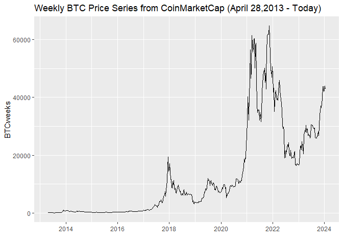
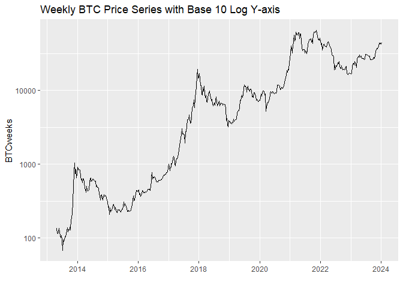

Bitcoin Price Time Series Analysis
================

## Overview

In this project, we examine the price history of bitcoin (BTC) across
various frequencies (daily, weekly, and monthly) and conduct tests for
time series stationarity. One key observation is that all of the price
series exhibit significant autocorrelation, which is consistent with a
time series being non-stationary. It is then demonstrated that
transforming the price series into a return series (by differencing the
natural logarithm of prices) resolves much of this autocorrelation and
is a more appropriate measurement for conducting statistical analysis in
asset pricing (e.g. CAPM, FF, etc).

Next, we’ll explore the time series decomposition of the price series
and practice with some R packages geared towards time series analysis.
These include the xts package, tseries package, and seasonal package.
With seasonality, there are a few options to consider. First is
day-of-week seasonality where we don’t find much of significant results.
A more common approach to modeling seasonality is with month-of-year
seasonality. Here, we find some marginal evidence that October tends to
outperform September in regard to BTC price appreciation.

Lastly, we’ll explore another aspect of seasonality around the four-year
halving cycle for Bitcoin. Given that there are still only a couple full
cycles that have been completed since BTC price data begins, these are
still in their infancy regarding any statistical conclusions.

## R Packages

- The [devtools package](https://cran.r-project.org/package=devtools)
  contains the `install_github()` function, which allows us to install
  packages directly from GitHub. This will let us install the geckor
  package, which is no longer published to CRAN.
- The [geckor package](https://github.com/next-game-solutions/geckor) is
  a wrapper for the [CoinGecko API](https://www.coingecko.com/en/api)
  and allows for easy import of bitcoin price data.
- The [xts package](https://cran.r-project.org/package=xts) is short for
  ‘eXtensible Time Series’, which contains tools for working with time
  series data.
- The [ggplot2 package](https://cran.r-project.org/package=ggplot2) for
  graphics and visuals.
- The [tseries package](https://cran.r-project.org/package=tseries)
  contains additional time series analysis functions that we will
  explore.
- The [seasonal package](https://cran.r-project.org/package=seasonal)
  contains an interface to the [Census X-13-ARIMA-SEATS
  model](https://www.census.gov/data/software/x13as.html).
- The [seasonalview
  package](https://cran.r-project.org/package=seasonalview) brings a
  graphical user interface to that Census model.
- The [rmarkdown package](https://cran.r-project.org/package=rmarkdown)
  is used to generate this R Notebook.

``` r
# Create list of packages needed for this exercise, omit geckor since its not on CRAN
list.of.packages = c("devtools","xts","ggplot2","tseries","seasonal","seasonalview","rmarkdown")
# Check if any have not yet been installed
new.packages = list.of.packages[!(list.of.packages %in% installed.packages()[,"Package"])]
# If any need to be installed, install them
if(length(new.packages)) install.packages(new.packages)
# Since geckor is no longer published to CRAN, install via GitHub
library(devtools)
```

    ## Loading required package: usethis

``` r
devtools::install_github("next-game-solutions/geckor")
```

    ## Skipping install of 'geckor' from a github remote, the SHA1 (40955dad) has not changed since last install.
    ##   Use `force = TRUE` to force installation

``` r
# Load in the remaining packages
library(geckor)
```

    ## R client for the CoinGecko API
    ## Developed by Next Game Solutions (http://nextgamesolutions.com)

``` r
library(xts)
```

    ## Loading required package: zoo

    ## 
    ## Attaching package: 'zoo'

    ## The following objects are masked from 'package:base':
    ## 
    ##     as.Date, as.Date.numeric

``` r
library(tseries)
```

    ## Registered S3 method overwritten by 'quantmod':
    ##   method            from
    ##   as.zoo.data.frame zoo

``` r
library(ggplot2)
library(seasonal)
library(seasonalview)
```

    ## 
    ## Attaching package: 'seasonalview'

    ## The following object is masked from 'package:seasonal':
    ## 
    ##     view

## Bitcoin Data Import

To import bitcoin prices, we will use the geckor R package, which
utilizes the CoinGecko API.

``` r
BTCraw = coin_history_range(coin_id="bitcoin",
                            vs_currency = "usd",
                            from = as.POSIXct("2013-04-27"),
                            to = as.POSIXct(Sys.Date()))
```

    ## Warning: Missing values found in column(s)
    ## • market_cap

Interestingly, as of May 2023, the above import code produces a warning
of some missing values in the market_cap column. If we more closely
examine (use `which()` and `is.na()` to identify the row numbers of the
missing values), these missing values appear to be for April 2, 2017.
Not sure why exactly this is, but since we have price data on each of
those days, we can impute these values without too much difficulty.

``` r
# Identify indices of missing values
missinginds = which(is.na(BTCraw$market_cap))
BTCraw[missinginds,]
```

    ## # A tibble: 1 × 6
    ##   timestamp           coin_id vs_currency price total_volume market_cap
    ##   <dttm>              <chr>   <chr>       <dbl>        <dbl>      <dbl>
    ## 1 2017-04-02 00:00:00 bitcoin usd         1098.    80231506.         NA

``` r
for (i in missinginds){
  # Subset data to 3-day period from [-1,1]
  subprice = BTCraw[(i-1):(i+1),]
  # Create ncoins variable by dividing market cap by price
  subprice$ncoins = subprice$market_cap/subprice$price
  # Impute missing value with average of day before and day after
  subprice$ncoins[2] = (subprice$ncoins[1]+subprice$ncoins[3])/2
  # Compute missing market cap as price*ncoins
  subprice$market_cap[2] = subprice$ncoins[2]*subprice$price[2]
  # Move imputed value back to main data frame
  BTCraw$market_cap[i] = subprice$market_cap[2]
}
sum(is.na(BTCraw)) # Verify no more missing values
```

    ## [1] 0

Then reformat the timestamp to a date variable:

``` r
BTCraw$Date = as.POSIXct(BTCraw$timestamp)
```

To better make use of the ordered nature of time series data like this,
we take the OHLC data and save it as an `xts` object. In the new
`BTCdaily` variable, the rows are indexed by the date variable, which
enables some additional functionality over a standard data frame.

``` r
BTCdaily = xts(BTCraw$price,order.by=BTCraw$Date)
```

Then as one point of comparison, we will examine various frequencies for
the price series. The `xts` package allows us to easily convert the
daily price data into weekly or monthly OHLC series.

``` r
BTCweeksOHLC = to.weekly(BTCdaily, drop.time=TRUE)
BTCweeks = BTCweeksOHLC$BTCdaily.Close
BTCmonthOHLC = to.monthly(BTCdaily, drop.time=TRUE)
BTCmonth = BTCmonthOHLC$BTCdaily.Close
```

## Exploring the Full Bitcoin Price Series

### Basic Price Charts

We’ll start with some simple plots of the BTC price series that we
downloaded. Starting with the daily chart, then weekly and monthly.

``` r
ggplot() +
  geom_line(aes(x=index(BTCdaily),y=BTCdaily)) +
  xlab("") +
  ggtitle("Daily BTC Price Series from CoinMarketCap (April 28,2013 - Today)")
```

    ## Don't know how to automatically pick scale for object of type <xts/zoo>.
    ## Defaulting to continuous.

<!-- -->

``` r
ggplot() +
  geom_line(aes(x=index(BTCweeks),y=BTCweeks)) +
  xlab("") +
  ggtitle("Weekly BTC Price Series from CoinMarketCap (April 28,2013 - Today)")
```

    ## Don't know how to automatically pick scale for object of type <xts/zoo>.
    ## Defaulting to continuous.

<!-- -->

``` r
ggplot() +
  geom_line(aes(x=index(BTCmonth),y=BTCmonth)) +
  xlab("") +
  ggtitle("Monthly BTC Price Series from CoinMarketCap (April 28,2013 - Today)")
```

    ## Don't know how to automatically pick scale for object of type <xts/zoo>.
    ## Defaulting to continuous.

<!-- -->

### Log Price Charts

As detailed in other projects, a more appropriate way to analyze
financial time series is to use rates of change (growth rates/returns)
instead of levels (prices). The first step in calculating continuously
compounded growth rates is to take the natural logarithm of the prices.
There are two approaches for plotting out the logged price charts. The
first approach is to simply compute the log(prices) and plot that
series.

``` r
ggplot() +
  geom_line(aes(x=index(BTCdaily), y=log(BTCdaily))) +
  xlab("") +
  ggtitle("Daily BTC Log Price Series (April 28,2013 - Today)")
```

    ## Don't know how to automatically pick scale for object of type <xts/zoo>.
    ## Defaulting to continuous.

<!-- -->

``` r
ggplot() +
  geom_line(aes(x=index(BTCweeks), y=log(BTCweeks))) +
  xlab("") +
  ggtitle("Weekly BTC Log Price Series (April 28,2013 - Today)")
```

    ## Don't know how to automatically pick scale for object of type <xts/zoo>.
    ## Defaulting to continuous.

<!-- -->

``` r
ggplot() +
  geom_line(aes(x=index(BTCmonth), y=log(BTCmonth))) +
  xlab("") +
  ggtitle("Monthly BTC Log Price Series (April 28,2013 - Today)")
```

    ## Don't know how to automatically pick scale for object of type <xts/zoo>.
    ## Defaulting to continuous.

<!-- -->

Alternatively, we can generate the same charts by instead plotting the
non-logged price series with a logarithmic y-axis. This is done in
`ggplot` with the `scale_y_continuous(trans='log10')` setting.

``` r
ggplot() +
  geom_line(aes(x=index(BTCdaily), y=BTCdaily)) +
  scale_y_continuous(trans='log10') +
  xlab("") +
  ggtitle("Daily BTC Price Series with Base 10 Log Y-axis")
```

<!-- -->

``` r
ggplot() +
  geom_line(aes(x=index(BTCweeks), y=BTCweeks)) +
  scale_y_continuous(trans='log10') +
  xlab("") +
  ggtitle("Weekly BTC Price Series with Base 10 Log Y-axis")
```

<!-- -->

``` r
ggplot() +
  geom_line(aes(x=index(BTCmonth), y=BTCmonth)) +
  scale_y_continuous(trans='log10') +
  xlab("") +
  ggtitle("Monthly BTC Price Series with Base 10 Log Y-axis")
```

<!-- -->

### Log Return Charts

Lastly, we’ll finish the price to return conversion by differencing the
log(prices). The steps for this involve converting the prices back to
numeric variables (from xts) so that they can be logged, and then
subtracting the `lag()` from each period to compute the log returns.
Since these are all at various frequencies, the last three lines convert
the returns to annualized returns in percentage units.

``` r
# Create data frames with date column
rBTCdaily = data.frame(Date=index(BTCdaily))
rBTCweeks = data.frame(Date=index(BTCweeks))
rBTCmonth = data.frame(Date=index(BTCmonth))
# Compute log returns
rBTCdaily$Return = log(as.numeric(BTCdaily)) - log(as.numeric(lag(BTCdaily)))
rBTCweeks$Return = log(as.numeric(BTCweeks)) - log(as.numeric(lag(BTCweeks)))
rBTCmonth$Return = log(as.numeric(BTCmonth)) - log(as.numeric(lag(BTCmonth)))
# Annualize returns
rBTCdaily$AnnRet = rBTCdaily$Return*100*365
rBTCweeks$AnnRet = rBTCweeks$Return*100*52
rBTCmonth$AnnRet = rBTCmonth$Return*100*12
# Remove first row of each data frame (missing due to differencing)
rBTCdaily = rBTCdaily[-1,]
rBTCweeks = rBTCweeks[-1,]
rBTCmonth = rBTCmonth[-1,]
```

With these annualized returns, we resolve much of the non-stationarity
present in the price series. With a more stationary process like
returns, a better way to plot the data is with a bar chart. The average
bar height (horizontal line) represents the average annual return, which
would translate to a constant exponential growth rate in the price
series. From the daily chart, we can see that BTC’s best day (as of May
2023) was on November 18, 2013, when the price closed at \$703.56, which
was up nearly 43% from the previous close of \$492. That corresponds
with an annualized return of 13,047% . On the other hand, BTC’s worst
day (as of May 2023) was around the economic shock of the onset of the
covid-19 pandemic. On March 12, 2020, the price fell from \$7,911.43 to
\$4,970.79. This decrease of 37% corresponds with an annualized loss of
13,567%. Similar extremes are exhibited in the weekly series; however,
the values are not as large of outliers relative to other weeks. Then
the monthly series shows only the November 2013 increase as an outlier.
This could be explained by the somewhat quick recovery in March 2020
(price returned above \$6,000 by March 19), or simply just a result of
the particular day-of-week cutoff for splitting out the weekly
observations.

``` r
ggplot(rBTCdaily,aes(x=Date,y=AnnRet))+
  geom_col()+
  xlab("") +
  ggtitle("BTC Annualized Daily Returns")
```

<!-- -->

``` r
ggplot(rBTCweeks,aes(x=Date,y=AnnRet))+
  geom_col()+
  xlab("") +
  ggtitle("BTC Annualized Weekly Returns")
```

<!-- -->

``` r
ggplot(rBTCmonth,aes(x=Date,y=AnnRet))+
  geom_col()+
  xlab("") +
  ggtitle("BTC Annualized Monthly Returns")
```

<!-- -->

### Summary Statistics

In summarizing the return series, we can compare across the various
frequencies. Since we annualized each series for their respective
frequencies, the means of each series represent the average annual
return. Below are two ways of computing the means and displaying the
results. The first creates a new data frame with the means and then
displays that data frame with values rounded to two decimals. The second
approach is more direct and computes each mean in a separate line, which
is wrapped in the `round()` function. From these means, the daily return
series produces the largest mean; however, the less frequent means are
only slightly smaller within 0.5%.

``` r
meanAnnRets = data.frame(BTCdaily=mean(rBTCdaily$AnnRet), BTCweeks=mean(rBTCweeks$AnnRet), BTCmonth=mean(rBTCmonth$AnnRet))
round(meanAnnRets,digits=2)
```

    ##   BTCdaily BTCweeks BTCmonth
    ## 1    53.74    53.56    53.56

``` r
round(mean(rBTCdaily$AnnRet), digits=2)
```

    ## [1] 53.74

``` r
round(mean(rBTCweeks$AnnRet), digits=2)
```

    ## [1] 53.56

``` r
round(mean(rBTCmonth$AnnRet), digits=2)
```

    ## [1] 53.56

However, from the volatilities (as measured by standard deviation of the
return series), we can see that the more frequent series exhibit
substantially more volatility.

``` r
meanRetVols = data.frame(BTCdaily=sd(rBTCdaily$AnnRet), BTCweeks=sd(rBTCweeks$AnnRet), BTCmonth=sd(rBTCmonth$AnnRet))
round(meanRetVols,digits=2)
```

    ##   BTCdaily BTCweeks BTCmonth
    ## 1  1443.03   574.71   315.56

One way to visualize the empirical distribution summarized by the mean
and standard deviation is to plot a frequency histogram of the return
series overlayed with a normal bell curve transformed by the empirical
mean and standard deviation. The below code chunk first selects a
reasonable bin width (`bw`) for each frequency (trial and error to
select), then saves a count of non-missing observations, and generates
the plot described above.

``` r
# Set desired binwidth and number of non-missing obs
bw = 500
n_daily = sum(!is.na(rBTCdaily$AnnRet))
# Plot histogram of annualized returns and overlay graph of normal bell curve with same means and standard deviation
ggplot(rBTCdaily,aes(AnnRet)) +
  geom_histogram(binwidth=bw) +
  stat_function(fun=function(x) dnorm(x, mean=mean(rBTCdaily$AnnRet, na.rm=TRUE),   sd=sd(rBTCdaily$AnnRet, na.rm=TRUE)) * n_daily * bw, color="darkred", linewidth=1) +
  xlab("Annualized Daily Growth Rates") +
  ylab("Frequency")
```

<!-- -->

``` r
bw = 100
n_weeks = sum(!is.na(rBTCweeks$AnnRet))
ggplot(rBTCweeks,aes(AnnRet)) +
  geom_histogram(binwidth=bw) +
  stat_function(fun=function(x) dnorm(x, mean=mean(rBTCweeks$AnnRet, na.rm=TRUE),   sd=sd(rBTCweeks$AnnRet, na.rm=TRUE)) * n_weeks * bw, color="darkred", linewidth=1) +
  xlab("Annualized Weekly Growth Rates") +
  ylab("Frequency")
```

<!-- -->

``` r
bw = 50
n_month = sum(!is.na(rBTCmonth$AnnRet))
ggplot(rBTCmonth,aes(AnnRet)) +
  geom_histogram(binwidth=bw) +
  stat_function(fun=function(x) dnorm(x, mean=mean(rBTCmonth$AnnRet, na.rm=TRUE),   sd=sd(rBTCmonth$AnnRet, na.rm=TRUE)) * n_month * bw, color="darkred", linewidth=1) +
  xlab("Annualized Monthly Growth Rates") +
  ylab("Frequency")
```

<!-- -->

The plots above show how the daily and weekly return series more closely
resemble the fitted bell curves. However, they do tend to have more tail
events than would be suggested by a normally distributed return series.
The monthly series is skewed quite a bit by one early observation
(November 2013) where the price rose from roughly \$200 to over \$1100,
which converts to an annualized return of more than 2000.

## Time Series Stationarity, Autocorrelation, and the Dickey-Fuller Test

A [Stationary](https://en.wikipedia.org/wiki/Stationary_process)
[Process](https://www.itl.nist.gov/div898/handbook/pmc/section4/pmc442.htm)
is one that has a constant mean, variance, and autocorrelation structure
over time. A [Non-Stationary
Process](https://www.investopedia.com/articles/trading/07/stationary.asp)
can have different aspects of non-stationarity, and financial variables
often exhibit those types of trends. As we could visually see from the
price and return plots, the prices had a clear upward trend over the
long-run, whereas the return series exhibited ‘flatter’ dynamics. A more
explicit way to visualize the autocorrelation structure of the time
series is to examine its [autocorrelation function
(ACF)](https://www.itl.nist.gov/div898/handbook/eda/section3/autocopl.htm).
The ACF effectively measures the correlation between $e_t$ and
$e_{t−1}$, and then for $e_t$ and $e_{t−2}$, and so on for as many lags
as desired. In each frequency, the price series exhibits substantial
autocorrelation, and the return series shows that much of it is
resolved, although there still are a few lags that exceed the error
bands.

``` r
acf(as.numeric(BTCdaily))
```

<!-- -->

``` r
acf(rBTCdaily$AnnRet)
```

<!-- -->

``` r
acf(as.numeric(BTCweeks))
```

<!-- -->

``` r
acf(rBTCweeks$AnnRet)
```

<!-- -->

``` r
acf(as.numeric(BTCmonth))
```

<!-- -->

``` r
acf(rBTCmonth$AnnRet)
```

<!-- -->

The [partial autocorrelation function
(PACF)](https://www.itl.nist.gov/div898/handbook/pmc/section4/pmc4463.htm)
is similar to the ACF, except it produces the estimates of each lag
after controlling for all shorter lags. In other words, rather than
measuring the correlation between $e_t$ and $e_{t−2}$, we’d measure the
linear regression coefficient for the second lag from a regression
including both the first and second lags. A notable feature here from
the price series is a very large (nearly 1) estimate, which follows from
the large autocorrelation. Then subsequent lags often fall within the
error bands, although some lags do exceed them. After converting to
returns, the PACF’s have a much more condensed y-axis, which reflects
the lower autocorrelation in the return series. Although, there
certainly are still some lags that cross the error bands for the daily
and weekly series.

``` r
pacf(as.numeric(BTCdaily))
```

<!-- -->

``` r
pacf(rBTCdaily$AnnRet)
```

<!-- -->

``` r
pacf(as.numeric(BTCweeks))
```

<!-- -->

``` r
pacf(rBTCweeks$AnnRet)
```

<!-- -->

``` r
pacf(as.numeric(BTCmonth))
```

<!-- -->

``` r
pacf(rBTCmonth$AnnRet)
```

<!-- -->

From the ACF and PACF, we can gather some visual evidence to support the
suggestion that the price series suffers from autocorrelation
(non-stationarity) and that the return series is stationary. To
explicitly test for this, the
[Augmented](https://en.wikipedia.org/wiki/Augmented_Dickey%E2%80%93Fuller_test)
[Dickey-Fuller](https://www.rdocumentation.org/packages/aTSA/versions/3.1.2/topics/adf.test)
[Test](https://cran.r-project.org/web/packages/tseries/tseries.pdf)
allows us to construct a null hypothesis of non-stationarity, which
implies that rejection of the null concludes stationarity. The
`adf.test()` function comes from the `tseries` R package and generates
the test statistic (Dickey-Fuller in the output) and p-value. We can see
that the price series have smaller (in magnitude) test statistics that
fail to reject the null, and then the return series produce larger (in
magnitude) test statistics that reject the null and conclude that the
return series are a stationary process.

``` r
adf.test(as.numeric(BTCdaily))
```

    ## 
    ##  Augmented Dickey-Fuller Test
    ## 
    ## data:  as.numeric(BTCdaily)
    ## Dickey-Fuller = -2.3365, Lag order = 15, p-value = 0.4358
    ## alternative hypothesis: stationary

``` r
adf.test(rBTCdaily$AnnRet)
```

    ## Warning in adf.test(rBTCdaily$AnnRet): p-value smaller than printed p-value

    ## 
    ##  Augmented Dickey-Fuller Test
    ## 
    ## data:  rBTCdaily$AnnRet
    ## Dickey-Fuller = -13.903, Lag order = 15, p-value = 0.01
    ## alternative hypothesis: stationary

``` r
adf.test(as.numeric(BTCweeks))
```

    ## 
    ##  Augmented Dickey-Fuller Test
    ## 
    ## data:  as.numeric(BTCweeks)
    ## Dickey-Fuller = -3.1174, Lag order = 8, p-value = 0.1053
    ## alternative hypothesis: stationary

``` r
adf.test(rBTCweeks$AnnRet)
```

    ## Warning in adf.test(rBTCweeks$AnnRet): p-value smaller than printed p-value

    ## 
    ##  Augmented Dickey-Fuller Test
    ## 
    ## data:  rBTCweeks$AnnRet
    ## Dickey-Fuller = -6.9235, Lag order = 8, p-value = 0.01
    ## alternative hypothesis: stationary

``` r
adf.test(as.numeric(BTCmonth))
```

    ## 
    ##  Augmented Dickey-Fuller Test
    ## 
    ## data:  as.numeric(BTCmonth)
    ## Dickey-Fuller = -2.4164, Lag order = 5, p-value = 0.4034
    ## alternative hypothesis: stationary

``` r
adf.test(rBTCmonth$AnnRet)
```

    ## Warning in adf.test(rBTCmonth$AnnRet): p-value smaller than printed p-value

    ## 
    ##  Augmented Dickey-Fuller Test
    ## 
    ## data:  rBTCmonth$AnnRet
    ## Dickey-Fuller = -4.3282, Lag order = 5, p-value = 0.01
    ## alternative hypothesis: stationary

If you want to dig deeper into the theory and underlying assumptions
behind these concepts, [Stationarity and Memory in Financial
Markets](https://towardsdatascience.com/non-stationarity-and-memory-in-financial-markets-fcef1fe76053)
has a nice discussion on the topic from a general context of financial
markets.

## Seasonality

### Day-of-Week Seasonality

Another area of concern when it comes to stationarity of a time series
is seasonality. For the time series that we have here, the first type of
‘season’ to check is day of the week for the daily series. One way to do
this is to generate a count variable ($count=1,2,...,T$), and then
calculate the remainder after dividing by 7. This [modulo
operation](https://en.wikipedia.org/wiki/Modulo_operation) is done with
`%%` in R. Then a quick test for seasonality is to regress the return
series on a factor variable of the remainders. The `as.factor()`
function will transform the numeric variable into a categorical variable
with 7 categories.

Another important piece to note in the second line below is that the
`+2` is used to shift which day of the week is set to the reference
category in the regression model. The 2-day shift was selected by first
running the regression without the shift and examining the estimates for
the day dummies. Since `as.factor(day)5` produced the most negative
estimate, then incrementing the count variable by two would shift that
up to 7, and $7 \mod 7 = 0$. Thus, after increasing the count by 2, the
most negative day will be the baseline, and all the day dummies produce
a positive coefficient. This shift will maximize the likelihood that we
find a significant result from the regression by comparing each other
day to one of the extremes. Even then, we obtain only one marginally
significant estimate for `as.factor(day)4`. Matching to the shifted day
variable, this corresponds with Monday, whereas the baseline
`as.factor(day)0` matches to Thursday. So we could conclude that Mondays
tend to outperform Thursdays; however, we can only reject the null
hypothesis of no difference at the 95% confidence level, and not 99%.
Another caveat to making such a conclusion is the small `R-squared`
values, which suggests that there isn’t much seasonality here to
capture.

``` r
rBTCdaily$count = 1:length(rBTCdaily$AnnRet)
rBTCdaily$day = (rBTCdaily$count+2) %% 7
weekreg = lm(AnnRet~as.factor(day),data=rBTCdaily)
summary(weekreg)
```

    ## 
    ## Call:
    ## lm(formula = AnnRet ~ as.factor(day), data = rBTCdaily)
    ## 
    ## Residuals:
    ##      Min       1Q   Median       3Q      Max 
    ## -15772.5   -532.0      8.7    590.1  10366.0 
    ## 
    ## Coefficients:
    ##                 Estimate Std. Error t value Pr(>|t|)  
    ## (Intercept)        2.005     61.021   0.033   0.9738  
    ## as.factor(day)1   70.873     86.335   0.821   0.4117  
    ## as.factor(day)2  146.025     86.335   1.691   0.0908 .
    ## as.factor(day)3   31.464     86.296   0.365   0.7154  
    ## as.factor(day)4  111.156     86.296   1.288   0.1978  
    ## as.factor(day)5  -60.070     86.296  -0.696   0.4864  
    ## as.factor(day)6   62.875     86.296   0.729   0.4663  
    ## ---
    ## Signif. codes:  0 '***' 0.001 '**' 0.01 '*' 0.05 '.' 0.1 ' ' 1
    ## 
    ## Residual standard error: 1443 on 3904 degrees of freedom
    ## Multiple R-squared:  0.001956,   Adjusted R-squared:  0.0004217 
    ## F-statistic: 1.275 on 6 and 3904 DF,  p-value: 0.2652

In addition to testing for seasonality, we can also include the count
variable as a linear time trend to see if returns are systematically
changing over time. As seen below, this loads slightly negative and very
insignificant.

``` r
weekreg2 = lm(AnnRet~count+as.factor(day),data=rBTCdaily)
summary(weekreg2)
```

    ## 
    ## Call:
    ## lm(formula = AnnRet ~ count + as.factor(day), data = rBTCdaily)
    ## 
    ## Residuals:
    ##      Min       1Q   Median       3Q      Max 
    ## -15765.6   -527.1      5.8    592.1  10362.6 
    ## 
    ## Coefficients:
    ##                  Estimate Std. Error t value Pr(>|t|)  
    ## (Intercept)      26.39980   72.97312   0.362   0.7175  
    ## count            -0.01246    0.02044  -0.610   0.5421  
    ## as.factor(day)1  70.84235   86.34187   0.820   0.4120  
    ## as.factor(day)2 146.00641   86.34186   1.691   0.0909 .
    ## as.factor(day)3  31.41431   86.30323   0.364   0.7159  
    ## as.factor(day)4 111.11874   86.30322   1.288   0.1980  
    ## as.factor(day)5 -60.09512   86.30320  -0.696   0.4863  
    ## as.factor(day)6  62.86243   86.30320   0.728   0.4664  
    ## ---
    ## Signif. codes:  0 '***' 0.001 '**' 0.01 '*' 0.05 '.' 0.1 ' ' 1
    ## 
    ## Residual standard error: 1443 on 3903 degrees of freedom
    ## Multiple R-squared:  0.002051,   Adjusted R-squared:  0.0002608 
    ## F-statistic: 1.146 on 7 and 3903 DF,  p-value: 0.3311

The models above show the decomposition of an observed time series into
(1) a trend component, (2) a seasonal component, (3) and a random
(residual/error) component. The `decompose()` function separates a time
series into those components and can be used to product an easy visual
plot of the decomposition. In the first line, the annual return series
is transformed into a time series object using the `ts()` function,
which has better compatibility with the `decompose()` function. The
`frequency=7` allows us to set the period cycle for seasonality to be
seven days in a week. Then the time component is indexed by weeks since
the start of the data series, as seen in the plots below.

``` r
BTCdailyts = ts(as.numeric(BTCdaily), frequency=7)
BTCdailytsdecomp = decompose(BTCdailyts)
plot(BTCdailytsdecomp)
```

<!-- -->

### Day-of-Year Seasonality

A more common approach to seasonality is to model the time of the year
to capture the impact of actual seasons. This can be done with the daily
price series; however, since the regression model would output
coefficients for all the 364 day dummy variables, we’ll just generate
the time series decomposition plot. One additional parameter we can
include in this case is indicating the starting point of the data. Since
this is an annual cycle, the first numeric input is the starting year,
and the 118 is derived from the first observation on April 28, which was
the 118th day of year in 2013. *An important flaw here may be the
handling of leap years. I’m not sure that the tseries package is
correctly handling leap years when the frequency is set to 365. It is
likely just modeling a 365-day cycle, so every leap year will shift the
particular dates by 1.*

``` r
BTCdayyearts = ts(as.numeric(BTCdaily), frequency=365, start=c(2013,118))
BTCdayyeartsdecomp = decompose(BTCdayyearts)
plot(BTCdayyeartsdecomp)
```

<!-- -->

### Month-of-Year Seasonality

The next level to test for seasonality at is for each month of the year.
Similar to above, we create a count in the monthly data frame, calculate
$count \mod 12$ with a 6-month shift (to adjust the baseline to the
worst month), and then regress the returns on a factor variable of the
remainders.

``` r
rBTCmonth$count = 1:length(rBTCmonth$AnnRet)
rBTCmonth$month = (rBTCmonth$count+6) %% 12
monthreg = lm(AnnRet~as.factor(month),data=rBTCmonth)
summary(monthreg)
```

    ## 
    ## Call:
    ## lm(formula = AnnRet ~ as.factor(month), data = rBTCmonth)
    ## 
    ## Residuals:
    ##     Min      1Q  Median      3Q     Max 
    ## -698.58 -175.05    3.27  142.95 1823.74 
    ## 
    ## Coefficients:
    ##                    Estimate Std. Error t value Pr(>|t|)  
    ## (Intercept)         230.710     94.699   2.436   0.0163 *
    ## as.factor(month)1    -2.229    133.925  -0.017   0.9867  
    ## as.factor(month)2  -189.689    133.925  -1.416   0.1593  
    ## as.factor(month)3  -273.812    133.925  -2.045   0.0431 *
    ## as.factor(month)4  -160.072    137.233  -1.166   0.2458  
    ## as.factor(month)5  -285.569    137.233  -2.081   0.0396 *
    ## as.factor(month)6  -129.082    137.233  -0.941   0.3488  
    ## as.factor(month)7  -160.416    133.925  -1.198   0.2334  
    ## as.factor(month)8  -236.112    133.925  -1.763   0.0805 .
    ## as.factor(month)9  -151.530    133.925  -1.131   0.2602  
    ## as.factor(month)10 -231.405    133.925  -1.728   0.0867 .
    ## as.factor(month)11 -309.794    133.925  -2.313   0.0225 *
    ## ---
    ## Signif. codes:  0 '***' 0.001 '**' 0.01 '*' 0.05 '.' 0.1 ' ' 1
    ## 
    ## Residual standard error: 314.1 on 117 degrees of freedom
    ## Multiple R-squared:  0.09448,    Adjusted R-squared:  0.00935 
    ## F-statistic:  1.11 on 11 and 117 DF,  p-value: 0.3598

With the 11 month dummies, we can see this seasonality explains a larger
proportion of the return volatility than the day-of-week seasonality.
However, only two months load marginally significant with p-values
between 0.01 and 0.05. These correspond with October and November
relative to the baseline of September. One could design a strategy
around this to try and capitalize on this seasonality.

Before moving on to adding a linear time trend, let’s recall that this
monthly series had a fairly large outlier in November 2013. So let’s
replicate the regression with that observation omitted to see if that
removes the statistical significance. We can easily omit that
observation by filtering `BTCmonth` by `index(BTCmonth)!="Nov 2013"`.
Then we can see that removing that one outlier reduces the coefficient
estimate by nearly 200%, and it is no longer significant at the 95%
level. But also, as of May 2023, this reduces the number of observations
in that category from 10 to 9. So losing any marginal significance is
not surprising here, but the large reduction in estimate magnitude shows
that one observation from 10 years ago was driving the results.

``` r
monthreg2 = lm(AnnRet~as.factor(month),data=rBTCmonth[rBTCmonth$Date!=as.yearmon("Nov 2013"),])
summary(monthreg2)
```

    ## 
    ## Call:
    ## lm(formula = AnnRet ~ as.factor(month), data = rBTCmonth[rBTCmonth$Date != 
    ##     as.yearmon("Nov 2013"), ])
    ## 
    ## Residuals:
    ##     Min      1Q  Median      3Q     Max 
    ## -557.40 -169.70   13.38  147.94  592.77 
    ## 
    ## Coefficients:
    ##                    Estimate Std. Error t value Pr(>|t|)   
    ## (Intercept)           230.7       78.6   2.935  0.00402 **
    ## as.factor(month)1    -184.6      113.9  -1.621  0.10780   
    ## as.factor(month)2    -189.7      111.2  -1.706  0.09059 . 
    ## as.factor(month)3    -273.8      111.2  -2.463  0.01524 * 
    ## as.factor(month)4    -160.1      113.9  -1.405  0.16259   
    ## as.factor(month)5    -285.6      113.9  -2.507  0.01356 * 
    ## as.factor(month)6    -129.1      113.9  -1.133  0.25944   
    ## as.factor(month)7    -160.4      111.2  -1.443  0.15168   
    ## as.factor(month)8    -236.1      111.2  -2.124  0.03578 * 
    ## as.factor(month)9    -151.5      111.2  -1.363  0.17546   
    ## as.factor(month)10   -231.4      111.2  -2.082  0.03956 * 
    ## as.factor(month)11   -309.8      111.2  -2.787  0.00622 **
    ## ---
    ## Signif. codes:  0 '***' 0.001 '**' 0.01 '*' 0.05 '.' 0.1 ' ' 1
    ## 
    ## Residual standard error: 260.7 on 116 degrees of freedom
    ## Multiple R-squared:  0.09599,    Adjusted R-squared:  0.01027 
    ## F-statistic:  1.12 on 11 and 116 DF,  p-value: 0.3523

Similar to daily series, the linear time trend is not significant.

``` r
monthreg2 = lm(AnnRet~count+as.factor(month),data=rBTCmonth[rBTCmonth$Date!=as.yearmon("Nov 2013"),])
summary(monthreg2)
```

    ## 
    ## Call:
    ## lm(formula = AnnRet ~ count + as.factor(month), data = rBTCmonth[rBTCmonth$Date != 
    ##     as.yearmon("Nov 2013"), ])
    ## 
    ## Residuals:
    ##    Min     1Q Median     3Q    Max 
    ## -567.3 -167.2   15.5  155.5  596.1 
    ## 
    ## Coefficients:
    ##                     Estimate Std. Error t value Pr(>|t|)   
    ## (Intercept)         212.5452    89.0629   2.386  0.01864 * 
    ## count                 0.2752     0.6267   0.439  0.66137   
    ## as.factor(month)1  -186.5298   114.3855  -1.631  0.10569   
    ## as.factor(month)2  -190.2396   111.5537  -1.705  0.09083 . 
    ## as.factor(month)3  -274.6373   111.5625  -2.462  0.01531 * 
    ## as.factor(month)4  -159.5217   114.3082  -1.396  0.16554   
    ## as.factor(month)5  -285.2940   114.3031  -2.496  0.01398 * 
    ## as.factor(month)6  -129.0825   114.3014  -1.129  0.26111   
    ## as.factor(month)7  -159.0398   111.5907  -1.425  0.15681   
    ## as.factor(month)8  -235.0107   111.5749  -2.106  0.03735 * 
    ## as.factor(month)9  -150.7046   111.5625  -1.351  0.17939   
    ## as.factor(month)10 -230.8547   111.5537  -2.069  0.04074 * 
    ## as.factor(month)11 -309.5183   111.5485  -2.775  0.00645 **
    ## ---
    ## Signif. codes:  0 '***' 0.001 '**' 0.01 '*' 0.05 '.' 0.1 ' ' 1
    ## 
    ## Residual standard error: 261.6 on 115 degrees of freedom
    ## Multiple R-squared:  0.09751,    Adjusted R-squared:  0.003334 
    ## F-statistic: 1.035 on 12 and 115 DF,  p-value: 0.4217

Now let’s plot out the full time series decomposition of the monthly
series. Since this is one of the more meaningful decompositions we’ll
generate, the final three lines below will create a high-quality output
of the plot in a pdf format.

``` r
BTCts_Close = ts(as.numeric(BTCmonth), frequency=12, start=c(2013,4))
BTCtsdecomp = decompose(BTCts_Close)
plot(BTCtsdecomp)
```

<!-- -->

``` r
# Create output pdf file for the plot, plot it, and save file.
# pdf("BTCtsdecomp_month_year.pdf", width=6)
# plot(BTCtsdecomp)
# dev.off()
```

### Bitcoin Halving Seasonality

One feature of the Bitcoin protocol is the reduction in block rewards
that occurs every four years. Specifically, this fixed portion of mining
rewards that are new bitcoins being mined into existence get reduced by
50% every 210,000 blocks. Since the mining process produces a new block
every 10 minutes, this translates to roughly 4 years.

$1 halving = 210,000 blocks \cdot \dfrac{10min}{1block} \cdot \dfrac{1hr}{60min} \cdot \dfrac{1day}{24hr} = 1,458days+8hr = 208.\overline{33}weeks = 3.995years$

In addition to not exactly measuring 4 years, there is the additional
variation around the 10 minute-per-block timing in the short-term. The
Bitcoin protocol has a difficulty adjustment that takes effect every
2,016 blocks (\$\$14 days). This automatic adjustment allows the mining
difficulty to adapt to changes in network hash rate without impacting
the block timing, which enables Bitcoin’s algorithmic monetary
inflation.

So there isn’t quite a clean way to split the halving timeline into
perfect cycles at any of the frequencies. But we can round to the
nearest whole number and see what we get with each.

#### Daily Halving Seasonality

The Bitcoin halving cycle is closest to 1,458 days, so lets examine the
time series decomposition with that frequency. One clear observation is
how the seasonal component now captures a large amount of the variation.
Since we just added 1,457 dummy variables to the regression model, it is
not surprising that absorbed much of the volatility. This is also why we
don’t display the summary of the results. Then the lack of three full
cycles leads to a flat period in the residual (random) and an abrupt
jump in the seasonal fit. This is expected since some remainders
(`dayhalf`) have only been observed twice in the data. As we approach
the 2024 halving, these jumps are expected to smooth out. Then to help
with the time conversion below is the conversion to the time label in
the plot.

- 2012 Halving (Nov. 28, block 210,000): No price data yet
- 2016 Halving (July 9, block 420,000): `dayhalf`=1169 $\implies$
  Time=1.80
- 2020 Halving (May 11, block 630,000): `dayhalf`=1113 $\implies$
  Time=2.76
- 2024 Halving (?, block 840,000): `dayhalf`=1057? $\implies$ Time=3.72?

``` r
rBTCdaily$dayhalf = rBTCdaily$count %% 1458
dailyhalfreg = lm(AnnRet~count+as.factor(dayhalf),data=rBTCdaily)
BTCdailyhalfts = ts(as.numeric(BTCdaily), frequency=1458)
BTCdailyhalftsdecomp = decompose(BTCdailyhalfts)
plot(BTCdailyhalftsdecomp)
```

<!-- -->

#### Weekly Halving Seasonality

- 2012 Halving (Nov. 28, block 210,000): No price data yet
- 2016 Halving (July 9, block 420,000): `weekhalf`=168 $\implies$
  Time=1.80
- 2020 Halving (May 11, block 630,000): `weekhalf`=161 $\implies$
  Time=2.77
- 2024 Halving (?, block 840,000): `weekhalf`=154? $\implies$ Time=3.74?

``` r
rBTCweeks$count = 1:length(rBTCweeks$AnnRet)
rBTCweeks$weekhalf = rBTCweeks$count %% 208
weekshalfreg = lm(AnnRet~count+as.factor(weekhalf),data=rBTCweeks)
BTCweekshalfts = ts(as.numeric(BTCweeks), frequency=208)
BTCweekshalftsdecomp = decompose(BTCweekshalfts)
plot(BTCweekshalftsdecomp)
```

<!-- -->

#### Monthly Halving Seasonality

- 2012 Halving (Nov. 28, block 210,000): No price data yet
- 2016 Halving (July 9, block 420,000): `monthhalf`=40 $\implies$
  Time=1.83
- 2020 Halving (May 11, block 630,000): `monthhalf`=38 $\implies$
  Time=2.79
- 2024 Halving (?, block 840,000): `monthhalf`=36? $\implies$ Time=3.75?

Since this is only 47 dummy variables in this one, let’s see if there
are any significant months and display the regression summary. There is
one marginally significant value of `monthhalf=8`, which corresponds to
November 2013, 2017, and 2021. If we recall the monthly return bar
chart, the November 2013 value was a major outlier with an annualized
return over 2000%. November 2017 was also a strong month for the bitcoin
price; however, November 2021 saw a decrease in bitcoin’s price. That
November 2021 decrease followed a strong October where bitcoin closed
the month above \$60,000 for the first time. So this may just be a side
effect of the imperfect scale of a 48-month cycle. I wonder if we could
get BTC price data down to a minute/second frequency and match prices to
the timestamps of Bitcoin blocks. Then the time dimension could be
converted to a block-series, rather than a time series. We could then
apply the seasonality to the exact block count to capture seasonality in
that respect. That’d be a fun project to pursue!

``` r
rBTCmonth$monthhalf = rBTCmonth$count %% 48
monthhalfreg = lm(AnnRet~count+as.factor(monthhalf),data=rBTCmonth)
summary(monthhalfreg)
```

    ## 
    ## Call:
    ## lm(formula = AnnRet ~ count + as.factor(monthhalf), data = rBTCmonth)
    ## 
    ## Residuals:
    ##     Min      1Q  Median      3Q     Max 
    ## -917.41 -147.86   -3.93  126.99 1182.01 
    ## 
    ## Coefficients:
    ##                         Estimate Std. Error t value Pr(>|t|)   
    ## (Intercept)             105.1489   216.6618   0.485  0.62878   
    ## count                    -0.3417     0.7228  -0.473  0.63764   
    ## as.factor(monthhalf)1   -54.8411   272.0292  -0.202  0.84074   
    ## as.factor(monthhalf)2  -175.9458   271.9860  -0.647  0.51955   
    ## as.factor(monthhalf)3    88.8011   271.9447   0.327  0.74487   
    ## as.factor(monthhalf)4   245.4140   271.9053   0.903  0.36946   
    ## as.factor(monthhalf)5  -191.2118   271.8678  -0.703  0.48389   
    ## as.factor(monthhalf)6   404.2540   271.8323   1.487  0.14091   
    ## as.factor(monthhalf)7   767.4547   271.7986   2.824  0.00599 **
    ## as.factor(monthhalf)8  -185.8107   271.7669  -0.684  0.49613   
    ## as.factor(monthhalf)9  -298.8611   271.7371  -1.100  0.27471   
    ## as.factor(monthhalf)10 -205.8230   271.7092  -0.758  0.45097   
    ## as.factor(monthhalf)11 -259.4110   271.6833  -0.955  0.34254   
    ## as.factor(monthhalf)12  -53.7579   271.6592  -0.198  0.84364   
    ## as.factor(monthhalf)13 -123.6524   271.6371  -0.455  0.65019   
    ## as.factor(monthhalf)14 -326.4578   271.6169  -1.202  0.23295   
    ## as.factor(monthhalf)15   57.8373   271.5987   0.213  0.83191   
    ## as.factor(monthhalf)16 -293.3894   271.5823  -1.080  0.28326   
    ## as.factor(monthhalf)17 -198.1948   271.5679  -0.730  0.46763   
    ## as.factor(monthhalf)18 -134.6388   271.5554  -0.496  0.62139   
    ## as.factor(monthhalf)19 -284.8044   271.5448  -1.049  0.29741   
    ## as.factor(monthhalf)20 -192.7963   271.5361  -0.710  0.47976   
    ## as.factor(monthhalf)21 -142.9738   271.5294  -0.527  0.59996   
    ## as.factor(monthhalf)22   30.0733   271.5246   0.111  0.91209   
    ## as.factor(monthhalf)23    2.2045   271.5217   0.008  0.99354   
    ## as.factor(monthhalf)24   18.8131   271.5208   0.069  0.94493   
    ## as.factor(monthhalf)25   75.0055   271.5217   0.276  0.78308   
    ## as.factor(monthhalf)26  157.3235   271.5246   0.579  0.56394   
    ## as.factor(monthhalf)27 -153.9238   271.5294  -0.567  0.57238   
    ## as.factor(monthhalf)28 -190.1016   271.5361  -0.700  0.48590   
    ## as.factor(monthhalf)29 -143.4637   271.5448  -0.528  0.59874   
    ## as.factor(monthhalf)30  184.1892   271.5554   0.678  0.49955   
    ## as.factor(monthhalf)31  -33.6938   271.5679  -0.124  0.90157   
    ## as.factor(monthhalf)32   -7.0443   271.5823  -0.026  0.97937   
    ## as.factor(monthhalf)33  -29.8310   271.5987  -0.110  0.91282   
    ## as.factor(monthhalf)34  -28.5582   297.6082  -0.096  0.92379   
    ## as.factor(monthhalf)35 -300.4542   297.5845  -1.010  0.31571   
    ## as.factor(monthhalf)36  147.5819   297.5625   0.496  0.62128   
    ## as.factor(monthhalf)37   78.1816   297.5423   0.263  0.79341   
    ## as.factor(monthhalf)38   26.1232   297.5239   0.088  0.93025   
    ## as.factor(monthhalf)39  -13.4922   297.5072  -0.045  0.96394   
    ## as.factor(monthhalf)40 -104.7372   297.4923  -0.352  0.72571   
    ## as.factor(monthhalf)41  -91.8037   297.4791  -0.309  0.75842   
    ## as.factor(monthhalf)42  133.9284   297.4677   0.450  0.65376   
    ## as.factor(monthhalf)43  130.8179   297.4580   0.440  0.66128   
    ## as.factor(monthhalf)44  353.5807   297.4501   1.189  0.23807   
    ## as.factor(monthhalf)45   21.8086   297.4440   0.073  0.94173   
    ## as.factor(monthhalf)46  228.9821   297.4396   0.770  0.44366   
    ## as.factor(monthhalf)47   -2.7136   297.4370  -0.009  0.99274   
    ## ---
    ## Signif. codes:  0 '***' 0.001 '**' 0.01 '*' 0.05 '.' 0.1 ' ' 1
    ## 
    ## Residual standard error: 297.4 on 80 degrees of freedom
    ## Multiple R-squared:  0.4447, Adjusted R-squared:  0.1116 
    ## F-statistic: 1.335 on 48 and 80 DF,  p-value: 0.1256

``` r
BTCmonthhalfts = ts(as.numeric(BTCmonth), frequency=48)
BTCmonthhalftsdecomp = decompose(BTCmonthhalfts)
plot(BTCmonthhalftsdecomp)
```

<!-- -->

``` r
# Create output pdf file for the plot, plot it, and save file.
# pdf("BTCtsdecomp_month_half.pdf", width=6)
# plot(BTCmonthhalftsdecomp)
# dev.off()
```

### A Deeper Dive on Seasonality

So far, we have just used some fairly basic seasonality tools from the
tseries package. A more in-depth package focused around seasonal
adjustments for time series data is the seasonal package. The `seas()`
function will output the main results from the X-13 ARIMA-SEATS seasonal
adjustment method. If you wish to explore this model in more detail,
uncomment the `view()` function in the code chunk below to generate a
shiny dashboard that allows you to interact with the model. This
dashboard is a local version of
[seasonal.website](http://www.seasonal.website/). See the [Introduction
to Seasonal](http://www.seasonal.website/seasonal.html) page for more
info.

``` r
BTCts_Close |> seas() ## |> view()
```

    ## 
    ## Call:
    ## seas(x = BTCts_Close)
    ## 
    ## Coefficients:
    ##        LS2013.Nov  AR-Nonseasonal-01  
    ##            1.7059             0.1195

The above output shows us some of the results from the time series model
that was estimated (X-13 ARIMA-SEATS). The first coefficient for
`LS2013.Nov` identifies that it was an outlier for the monthly return
series. This is identified even for the price model because the return
transformation that we did effectively represents the “I” in the ARIMA
of the model name. That “I” stands for “integrated” in the longer
acronym of [AutoRegressive Integrated Moving
Average](https://search.brave.com/search?q=arima). Thus, if you switch
from “Original and Adjusted Series” to the option directly below with a
(%), that will transform the graph to the same shape as the return
series, but without the annualization.

``` r
BTCts_AnnRet = ts(rBTCmonth$AnnRet, frequency=12, start=c(2013,4))
BTCts_AnnRet |> seas() ## |> view()
```

    ## 
    ## Call:
    ## seas(x = BTCts_AnnRet)
    ## 
    ## Coefficients:
    ##        Easter[15]         AO2013.Oct  AR-Nonseasonal-01  
    ##          248.1319          2046.3467             0.1362
